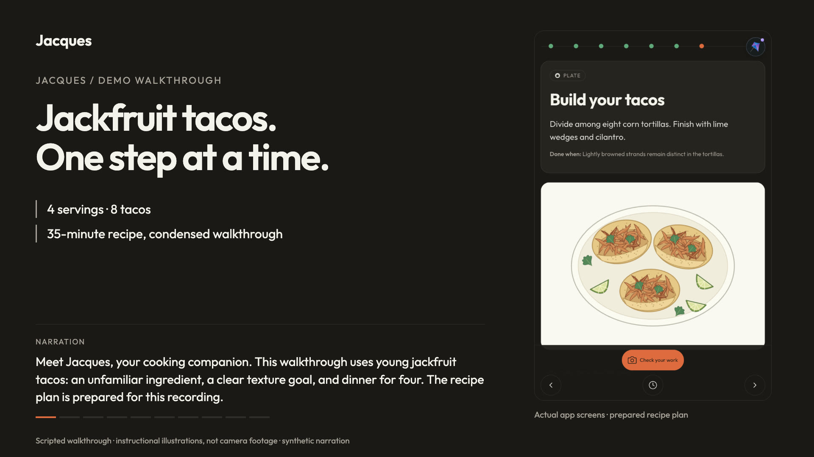

# Jacques — an agentic sous chef embedded in the cook's walkthrough

[](https://youtu.be/iPtG0UWhNS8)

Production: https://thought-partners-mu.vercel.app (auto-deploys from `main`).

Video demo: [Watch Jacques on YouTube](https://youtu.be/iPtG0UWhNS8).

## What it is and the problem it solves

Jacques is a Next.js PWA that turns a pasted recipe URL or text into a structured, step-at-a-time cooking plan, then coaches you through it on a phone propped against a bowl. Cooking is the environment, and it is a hostile one for a chatbot: your hands are wet, your attention is on the pan, and "scroll up to re-read what you told me" is not an option. Jacques solves that by keeping a single, unambiguous current step in front of the cook — timer, doneness cue, technique image, and answers to "how small is finely diced?" — without the cook ever leaving that step. The whole loop runs end to end today: paste a recipe, get a plan, walk the steps, ask questions, start timers, get heartbeat nudges on long simmers, and snap a photo for a verdict — all backed by live server-side model calls.

## Why the agent-in-context beats a standalone chatbot

A standalone chatbot would make you re-describe your situation every turn. Jacques' agent is mounted inside the running walkthrough, so it already knows where you are and can change what you see. Two live context feeds stream the recipe and the cook's exact position — step id, index-of-total, detail, the `doneWhen` sensory cue, ingredients, tools, and whether a timer is running — into the model on every turn. And it doesn't just talk: three typed frontend tools (`highlight_step`, `start_timer`, `show_heartbeat`) mutate the same Zustand store the on-screen buttons do, so "start the timer" or "show me the folding step" moves the real UI, not a chat transcript. That bidirectional loop — the environment shapes what the agent sees, and the agent drives the environment through the same state a human touches — is the central pattern, and it is precisely what could not be reproduced in a standalone chatbox.

## How the environment shapes the core workflow

The design deliberately keeps the LLM at the leaves rather than improvising a live agent loop over the whole session. One structured generation produces the deterministic plan — watchable and testable — and the agent then operates within that plan's rails, which is what makes it demo-reliable rather than a latency-prone free-for-all. Every model surface is wrapped in graceful degradation: recipe import retries once on a schema failure and falls back to a committed fixture; agentic Q&A streams from the CopilotKit agent first and falls back to a plain streaming `/api/ask` route if the agent isn't ready, so a question is never dropped; heartbeat lines run under a hard 2.5-second timeout with a deterministic fallback; vision refuses to guess, returning `off` with "retake closer" when a photo is unclear; pre-generated technique images are cached by prompt hash and never block a step render. Navigation aborts in-flight requests and generation counters reject stale writes, so the UI never shows an answer for the wrong step.

## Technical execution

- Framework: Next.js 16 App Router, React 19, TypeScript, Tailwind v4, deployed to Vercel as an installable PWA (manifest, service worker, offline page).
- Agent runtime: CopilotKit v2 (`@copilotkit/react-core` + `@copilotkit/runtime`) — a server-side `BuiltInAgent` (`maxSteps 4`) with the Jacques system prompt, exposed to the browser via `CopilotKitProvider` at `/api/copilotkit`; frontend tools and live context defined with `useFrontendTool` and `useAgentContext`.
- Model access: Vercel AI SDK v7 (`ai`) through `@openrouter/ai-sdk-provider`. Every call is server-side; `OPENROUTER_API_KEY` never reaches the browser. Model pins live in one file (`src/lib/models.ts`), so a rate limit or outage is a one-line swap — `gpt-4.1-mini` for plan/ask/agent, `gpt-5-mini` for vision, `gpt-4.1-nano` for heartbeat.
- Structured generation + safety: zod v4 mirrors the frozen `RecipePlan`/`VisionVerdict` contracts for `generateObject`, plus request validation and media size/type guards on every route.
- State: a single Zustand store is the shared surface for buttons, timers, and agent tools alike.
- Reliability: 92 Vitest tests across 24 files pass, covering routes, hooks, store, schemas, and the agent bridge; URL kill switches (`?fixture=1`, `?noimages=1`, `?novoice=1`, `?nowatch=1`) guarantee an offline, network-free demo path.

## Usefulness and agentic experience

The interface is kitchen-grade: huge type, dark shell, thumb-sized controls (previous, timer, mic, camera, next), one active step. The agent performs meaningful actions with the user always in control — it answers in ≤60-word imperative steps without losing your place, starts and cancels timers, surfaces coaching toasts on long steps, and returns one actionable fix from a photo — every result reflected in the same UI the cook also drives by hand. Context is used intelligently but never hijacks: manual controls always work, the agent shares state rather than owning it, and the kill switches hand explicit control back to the user. The result feels native to cooking rather than bolted on — a sous chef that keeps you on the same step it is helping with.

**Honest scope:** the realtime endpoint currently validates and acknowledges microphone/camera media (Watch Me capture works on-device) but does not yet transcribe it or speak back; full realtime voice coaching (`gpt-audio-mini`) is pinned and planned, not connected, and the landing fixture's sample answers and verdicts are scripted UI examples. Everything described above under the agent, plan, Q&A, vision, heartbeat, and images is live against OpenRouter today.

## Run locally

```bash
pnpm install
cp .env.example .env.local   # set OPENROUTER_API_KEY
pnpm dev                     # http://localhost:3000
```

`pnpm test`, `pnpm typecheck`, `pnpm lint`, `pnpm build`.

## Repository resources

- **Sample recipes:** `samples/cooklang/` contains curated Cooklang-style recipes grouped by `familiar/`, `exotic/`, and `centerpiece/`. See `samples/AGENTS.md` for the recipe conventions and `-- watch:` visual cue format.
- **Design system:** `DESIGN.md` is the required visual source of truth for cooking screens.

## Staged demo images

Use **Browse recipe demo images** on the landing screen, or open `/demo-images.html`. The gallery contains 44 local, 800×600 SVG illustrations: prep, cooking/assembly, and finished stages for all 12 Cooklang samples, plus all 8 Carbonara walkthrough steps. Each stage has a caption and full-size image link.

These are deterministic instructional drawings, not photos, camera captures, or AI assessments. Use them as visual references in a scripted demo, not as realistic vision-test inputs or evidence of food safety. The sample recipes are browsable in the gallery; this image set does not add sample recipe selection to the walkthrough.

Artwork sources live in `scripts/demo-images/`. Run `pnpm fixture-images` (or `node scripts/generate-fixture-images.mjs`) to regenerate the assets, gallery, and `/images/demo/index.json` manifest. The manifest maps each recipe's source file and stage descriptions to local image URLs; no API key or network is needed to generate them.

`?noimages=1` suppresses image rendering and requests in both the gallery and walkthrough. Carbonara images use the existing fixture prewarm below. For an offline gallery demo on production, visit the app first to activate its service worker, open the gallery, and scroll through the stages you will show while still online.

## Jackfruit taco demo video

Open `/jackfruit-demo.html` for a **1:54 narrated, captioned walkthrough** with chapter controls, a transcript, and downloads. The 1920×1080 H.264/AAC recording is at `/demos/jackfruit-tacos.mp4`; English captions are at `/demos/jackfruit-tacos.vtt`. Download the MP4 before presenting for network-independent playback.

The video uses actual app screens with a prepared plan based on `samples/cooklang/exotic/young-jackfruit-tacos.cook`. It shows recipe input, prep and texture cues, question prompts, a started timer, the current Watch Me panel, and plating. It is a scripted screenshot walkthrough with synthetic narration and instructional illustrations—not live recipe generation, live Q&A, cooking footage, or AI food assessment. It does not add jackfruit selection to the app.

The player honors `?noimages=1` by loading neither the video nor its poster; the transcript and explicit download links remain available. Voice in the MP4 is prerecorded narration, not the app's microphone/voice feature.

## Microphone and camera check

Open `/?fixture=1`, use the bottom **Microphone capture** control or scroll to **Watch Me**, and select **Start capture**. Allow camera and microphone access to see the live preview and input-level meter. Fixture mode keeps media on the device and sends no API requests. The demo fix/readiness buttons show explicitly scripted examples, not model output. Timers run without stopping capture; navigating to another step releases both devices.

Outside fixture mode, a loaded walkthrough posts microphone chunks and JPEG frames to `/api/realtime` about every 1.5 seconds. That endpoint validates and acknowledges receipt only; it does not forward media to OpenRouter. Recorder chunks are not standalone speech turns.

**Cancel capture**, **Stop capture**, changing steps/recipes, and unmounting release media resources. Late permission grants from a canceled session are stopped rather than reopening capture. If one device is denied, the other can still run.

Use HTTPS or localhost. A phone opened at an HTTP LAN address cannot access media. Check browser permissions and OS privacy settings after a denial. Verify real microphone input separately on the demo phone, including the installed iOS PWA; automated smoke checks use synthetic media.

## Kill switches (URL query)

| Flag | Effect |
| --- | --- |
| `?fixture=1` | Loads `src/fixtures/plan.carbonara.json`, calls no `/api/*` routes, works offline after prewarm. |
| `?noimages=1` | No step images are rendered or fetched. |
| `?novoice=1` | No microphone capture or audio context; Watch Me camera preview remains available. |
| `?nowatch=1` | Watch Me camera-assisted coaching is hidden/disabled. |

## Offline prewarm (before a demo)

1. Open `/?fixture=1` online and wait a few seconds for the service worker to activate.
2. Reload twice.
3. Disable the network and confirm the page and step images still load.

## Health

`GET /api/health` → `{ status, uptimeMs, timestamp, keys: { openrouter: boolean } }`. `keys.openrouter` must be `true` on production.

## Docs
Start with `AGENTS.md` for agent-facing repo guidance, especially before implementing Dave's Google Stitch UX.


- `AGENTS.md` — agent-facing repo map, Stitch UX integration notes, Watch Me and sample recipe pointers
- `docs/PLAN.md` — build plan, frozen contracts, Watch Me priority, and sample recipe fixture note
- `docs/WATCH_ME_PLAN.md` — Watch Me feature plan and OpenRouter streaming architecture
- `docs/features/glue-and-deploy/system-design.md` — Track C (glue, deploy, kill switches, heartbeat)
- `samples/AGENTS.md` — sample recipe collection guide and Watch Me cue conventions
- `DESIGN.md` — visual design system, including Watch Me panel guidance
