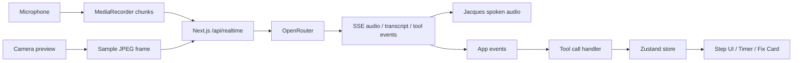

# Watch Me Feature Plan

## One-line pitch

**Watch Me turns Jacques from a voice-command assistant into an ambient sous chef that listens, sees the current cooking surface, stays quiet by default, and speaks only when a visual correction or readiness cue matters.**

## Why this belongs in the demo

The main Jacques POC plan targets a recipe walkthrough with step cards, timers, Q&A, voice, heartbeat, and optional vision verdict. Watch Me combines those pieces into one memorable moment once the main flow exists:

1. User taps **Watch Me** on a step.
2. Phone camera points at the board or pan.
3. Jacques receives microphone audio plus sampled camera frames.
4. Jacques compares the visible state against the current step's `doneWhen` cue.
5. Jacques either stays silent or gives one concrete correction.
6. Jacques can update the UI through tool calls while speaking.

This is more advanced than voice commands because it demonstrates realtime multimodal coaching, interruption, selective silence, and app control.

## Scope decision

Build **one polished Watch Me moment**, not whole-recipe continuous camera monitoring.

Recommended demo step:

- Sauté onions until translucent, no browning.

Why:

- Easy visual state: raw white onion → glossy/translucent → browned.
- Obvious correction: lower heat, stir, wait before garlic.
- Safe to discuss as cooking quality, not knife safety.
- Works on a phone camera pointed at a pan.

Avoid for demo:

- Knife safety guarantees.
- Meat doneness guarantees.
- Food-safety claims.
- Full 30 FPS streaming.
- Whole-recipe autonomous watching.


## Current codebase alignment

Latest check-in is a Next 16 PWA scaffold using `pnpm`, an in-memory recipe store in `src/lib/recipes.ts`, `GET/POST /api/recipes`, `GET /api/recipes/[id]`, and seeded recipes shaped as:

```ts
type Recipe = {
  id: string;
  title: string;
  servings: number;
  steps: {
    id: string;
    instruction: string;
    durationSeconds?: number;
    doneWhen?: string;
  }[];
};
```

Current implementation includes the one small data hook Watch Me needs: optional `doneWhen` cues on `RecipeStep`. The main app still does **not** yet have the richer `RecipePlan`/`Step` contract from `docs/PLAN.md`, a Zustand walkthrough store, `/api/import`, `/api/realtime`, or a recipe walkthrough route. Therefore Watch Me must stay additive:

- bind first to the current seeded `Recipe` / `RecipeStep` shape
- treat `RecipeStep.instruction` as the visible step text
- use `RecipeStep.doneWhen` as the visual target when available
- move state into the shared walkthrough store only after that store lands
- keep the OpenRouter key server-side; `.env.example` names only `OPENROUTER_API_KEY`

## Priority

Add to `PLAN.md` priority ladder as:

| Prio | Feature | Owner track |
|---|---|---|
| P2 | Watch Me: OpenRouter streaming voice + camera snapshots + proactive tool calls | B + C |

Cut order:

- If P0/P1 are unstable, cut Watch Me entirely.
- If voice works but camera is unstable, demo voice Q&A only.
- If camera works but proactive behavior is noisy, make Watch Me user-triggered: "Does this look right?"

## User experience

### Entry point

On each step card, show a **Watch Me** button when the step has a visual cue:

- `doneWhen` present
- `kind` is `prep`, `heat`, `wait`, `combine`, or `check`
- camera permission available

Button states:

- `Watch Me`
- `Watching...`
- `Jacques saw an issue`
- `Looks ready`
- `Camera unavailable`

### Watch overlay

When active, show:

- camera preview
- current visual target: `doneWhen`
- last Jacques message
- last fix card
- optional live transcript/debug strip
- stop button

Example copy:

```txt
Watching for:
Onions glossy and translucent, with no brown edges.

Jacques will stay quiet unless something needs attention.
```

### Demo script

Step card:

> Sweat onions until translucent, no browning.

User taps **Watch Me**.

Jacques:

> "I'm watching for glossy, translucent onion with no brown edges."

After a frame that shows browning:

> "Edges are browning early. Lower the heat one notch and stir for ten seconds."

UI updates:

- fix card: `Lower heat one notch and stir for 10 seconds.`
- risk badge: `Browning too early`
- timer starts at `10s`

User interrupts:

> "Should I add garlic now?"

Jacques:

> "Not yet. Garlic burns fast. Add it after the onions turn glossy."

## OpenRouter streaming architecture

Use a server-side OpenRouter proxy for microphone turns, sampled images, streamed audio, and tool calls.



### Transport split

- Microphone audio: `MediaRecorder` chunks posted to `/api/realtime`.
- Jacques audio: streamed from the server proxy over SSE.
- Camera frames: JPEG `input_image` data posted to the same proxy.
- Function calls: normalized tool events streamed from the proxy.
- UI updates: local tool handler mutates the current client state; move the same actions into the shared Zustand store once that store exists.

## Client contract

First pass against the current codebase should adapt the existing `RecipeStep` instead of requiring the richer future `Step` type:

```ts
type WatchableStep = {
  id: string;
  title: string; // current fallback: RecipeStep.instruction
  instruction: string;
  durationSeconds?: number;
  doneWhen?: string; // future Step.doneWhen; temporary fallback is inferred from instruction
};
```

Adapter:

```ts
function toWatchableStep(step: RecipeStep): WatchableStep {
  return {
    id: step.id,
    title: step.instruction,
    instruction: step.instruction,
    durationSeconds: step.durationSeconds,
    doneWhen: step.doneWhen,
  };
}
```

Add Watch Me state locally in the walkthrough component first. Move it into `src/lib/store.ts` when the shared walkthrough store lands:

```ts
interface WatchState {
  active: boolean;
  status: 'idle' | 'watching' | 'coach' | 'intervene' | 'ready' | 'error';
  lastMessage?: string;
  lastFix?: string;
  risk?: {
    level: 'low' | 'medium' | 'high';
    message: string;
  };
}
```

Future store actions:

```ts
startWatch(): void;
stopWatch(): void;
showFix(message: string): void;
flagRisk(level: 'low' | 'medium' | 'high', message: string): void;
markStepReady(cue: string): void;
recordDeviation(note: string): void;
```

No required structural changes to `src/lib/recipes.ts` beyond the additive optional `doneWhen` field. Optional later field, only after the richer `Step` contract exists:

```ts
interface Step {
  watchPrompt?: string; // visual cue for Watch Me, defaults to doneWhen
}
```

## Watch Me model instruction

Use this instruction when Watch Me is active:

```txt
You are Jacques, a real-time sous chef watching the current cooking step.

Default to silence. Speak only when:
- the user asks a question
- the visual state suggests a concrete correction
- the step appears ready based on the provided doneWhen cue
- a timer or attention checkpoint requires a short prompt

When you speak:
- use 25 words or fewer
- give one concrete action
- use sensory cues: color, texture, bubbles, steam, sound
- never claim certainty if the image is unclear
- never make food-safety guarantees
- use tools to update the UI when you identify a correction, risk, timer, deviation, or readiness cue

Current step and recipe context are the source of truth.
Do not invent ingredients, times, or steps.
```

## Frame sampling behavior

When Watch Me is active:

- Capture one JPEG frame every `1500ms`.
- Use low or medium resolution.
- Send `detail: 'low'` unless the step needs texture detail.
- Include the current step instruction and visual target with every frame.
- Ask the model to stay silent if no correction is needed.
- Stop frame capture immediately when Watch Me is off.

Pseudo-code:

```ts
async function sendWatchFrame({ dataChannel, frameBase64, step }: Args) {
  dataChannel.send(JSON.stringify({
    type: 'conversation.item.create',
    item: {
      type: 'message',
      role: 'user',
      content: [
        {
          type: 'input_text',
          text: [
            'Watch-mode frame.',
            `Current step: ${step.title ?? step.instruction}`,
            `Instruction: ${step.instruction}`,
            `Watch target: ${step.doneWhen ?? 'Use the step instruction as the visual target.'}`,
            'If no correction is needed, stay silent.',
            'If correction is needed, speak briefly and call a UI tool.',
          ].join('\n'),
        },
        {
          type: 'input_image',
          image_url: `data:image/jpeg;base64,${frameBase64}`,
          detail: 'low',
        },
      ],
    },
  }));

  dataChannel.send(JSON.stringify({
    type: 'response.create',
    response: {
      output_modalities: ['audio'],
    },
  }));
}
```

## Tool declarations

Expose only safe UI tools:

```ts
const watchTools = [
  {
    type: 'function',
    name: 'show_fix',
    description: 'Show one concrete cooking correction in the UI.',
    parameters: {
      type: 'object',
      properties: {
        message: { type: 'string' },
      },
      required: ['message'],
    },
  },
  {
    type: 'function',
    name: 'flag_risk',
    description: 'Flag a visible cooking risk or quality issue.',
    parameters: {
      type: 'object',
      properties: {
        level: { type: 'string', enum: ['low', 'medium', 'high'] },
        message: { type: 'string' },
      },
      required: ['level', 'message'],
    },
  },
  {
    type: 'function',
    name: 'start_timer',
    description: 'Start a visible cooking timer.',
    parameters: {
      type: 'object',
      properties: {
        seconds: { type: 'number' },
        label: { type: 'string' },
      },
      required: ['seconds', 'label'],
    },
  },
  {
    type: 'function',
    name: 'mark_step_ready',
    description: 'Mark the current step as visually ready to advance.',
    parameters: {
      type: 'object',
      properties: {
        cue: { type: 'string' },
      },
      required: ['cue'],
    },
  },
  {
    type: 'function',
    name: 'record_deviation',
    description: 'Record a user-stated or visually observed deviation from the recipe.',
    parameters: {
      type: 'object',
      properties: {
        note: { type: 'string' },
      },
      required: ['note'],
    },
  },
];
```

## Tool-call handling

When the SSE stream receives a completed tool call:

1. Parse arguments.
2. Execute the matching local store action.
3. Send `function_call_output` back through the server proxy.
4. Let the model continue speaking if needed.

Pseudo-code:

```ts
function handleWatchEvent(event: WatchEvent) {
  if (event.type !== 'tool_call') return;

  const args = JSON.parse(event.arguments);

  switch (event.name) {
    case 'show_fix':
      store.showFix(args.message);
      break;
    case 'flag_risk':
      store.flagRisk(args.level, args.message);
      break;
    case 'start_timer':
      store.startTimer(args.seconds, args.label);
      break;
    case 'mark_step_ready':
      store.markStepReady(args.cue);
      break;
    case 'record_deviation':
      store.recordDeviation(args.note);
      break;
  }

  dataChannel.send(JSON.stringify({
    type: 'conversation.item.create',
    item: {
      type: 'function_call_output',
      call_id: event.call_id,
      output: JSON.stringify({ ok: true }),
    },
  }));
}
```

## File ownership

Track B owns:

- Watch Me button
- camera preview overlay
- fix/risk/readiness cards
- store state/actions

Track C owns:

- OpenRouter server proxy and streaming session
- SSE event handling
- microphone/audio lifecycle
- frame capture loop
- kill switch

Track A does not need to change anything else for the first Watch Me pass. The current scaffold already has `RecipeStep.doneWhen`; no further required edits to `src/lib/recipes.ts`, `/api/recipes`, or `/api/recipes/[id]`.

## Kill switches

Add query params:

- `?novoice=1` disables streaming voice audio.
- `?nowatch=1` hides Watch Me.
- `?fixture=1` keeps the walkthrough offline.

If camera permission fails:

- keep voice available
- show `Camera unavailable`
- fall back to existing `/api/vision` upload flow if present

## Acceptance criteria

Demo acceptance:

1. User can start Watch Me from one visual step.
2. Browser requests camera permission and shows preview.
3. The server-side OpenRouter proxy receives microphone audio.
4. Client sends at least one JPEG frame as `input_image` through the proxy.
5. Jacques gives a short spoken correction when prompted by a visible issue or staged demo image.
6. Jacques calls at least one UI tool.
7. UI visibly updates from that tool call.
8. User can interrupt Jacques with a spoken question.
9. Stopping Watch Me stops camera tracks and frame interval.

Engineering acceptance:

- No OpenRouter API key in client code.
- Watch Me is optional and does not block recipe listing, recipe details, import, or walkthrough.
- No irreversible actions are exposed as tools.
- No food-safety guarantees in prompts or UI copy.
- App remains usable with `?nowatch=1`.

## Minimal build sequence

1. Add Watch Me UI shell against a seeded recipe step or fixture step.
2. Add camera preview and frame capture helper.
3. Wire the server-side OpenRouter audio stream.
4. Send one image frame manually and get a spoken response.
5. Add `show_fix` and `start_timer` tool handling.
6. Add frame loop gated by Watch Me state.
7. Tune prompt so Jacques stays silent unless useful.
8. Rehearse one staged visual correction.

## Rehearsal asset

If live pan/camera conditions are unreliable, use a printed or laptop-displayed staged image of onions with brown edges. The feature still proves image input, voice output, and tool-calling UI updates.

## Final pitch line

**Jacques is not waiting for a question. He is watching for the cooking cue, staying quiet when things look fine, and stepping in when a human sous chef would.**
