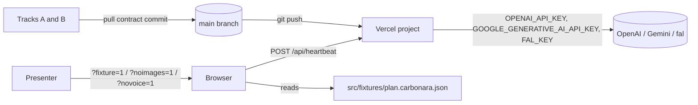
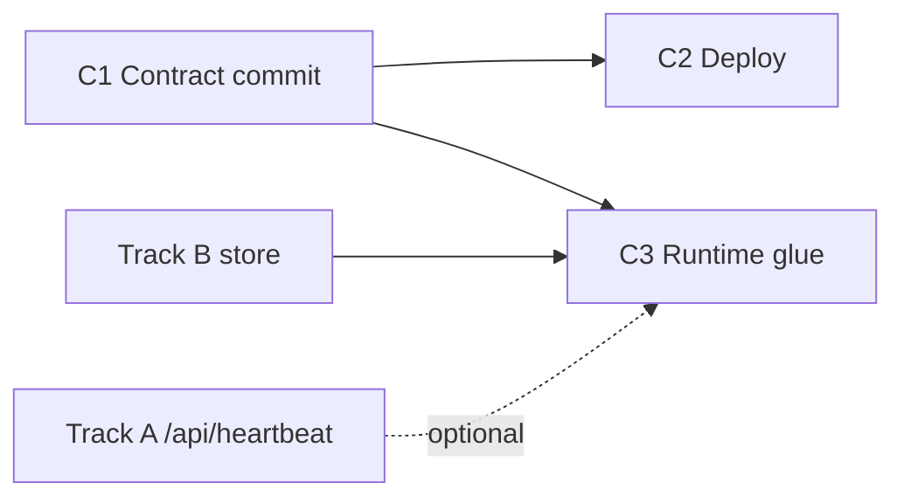

# Glue & Deploy — System Design

**Feature:** Track C of `PLAN.md` §4 minus the voice work (`useJacquesVoice()`, `src/lib/realtime/**`, `/api/realtime/token`). Voice remains a separate feature; this design only defines the boundary it plugs into.
**Sources:** `PLAN.md` @ `7c9591d` (§2–§7), `vision.md` @ `d832adb`, working tree @ `60cbf0d`.
**Status:** draft. Open decisions are tagged `[NEEDS YOUR CALL]`.

## 1. Scope and non-goals

Track C is the integration owner. This feature owns three things the other tracks cannot start or finish without:

1. The **contract commit** on `main`: shared types, the demo fixture, stub route handlers, and the model-pin file.
2. The **deployed environment**: Vercel project, env keys, and the build gate run at each checkpoint.
3. The **runtime glue** on the client: kill switches, the app shell (`layout.tsx`), and heartbeat check-ins delivered as a toast.

Non-goals: voice (all of `PLAN.md` §4C bullets 3 and the "speak line via the live session" branch of bullet 4); any route handler body other than stubs; any `StepCard`/store UI beyond the `HeartbeatToast` trigger; persistence, auth, Cooklang (`PLAN.md` §1 "cut" row); a pipeline or CI beyond `pnpm build`.

## 2. System context and actors



| Actor | Role at this boundary |
| --- | --- |
| Track A (server) | Consumes `src/lib/types.ts`, `src/lib/models.ts`, fixture; replaces stub route bodies in place. |
| Track B (client) | Consumes `src/lib/types.ts`, fixture; owns `src/lib/store.ts`, whose actions this feature calls. |
| Presenter | Toggles kill switches by URL; relies on `?fixture=1` when the venue network dies. |
| Vercel | Hosts the single Next.js app; holds the provider keys. |
| Model providers | Reached only from server routes; never from the browser. |

## 3. Components and responsibility boundaries

| Component | Owner files | Responsibility | Not responsible for |
| --- | --- | --- | --- |
| Contract commit | `src/lib/types.ts`, `src/fixtures/plan.carbonara.json`, `src/lib/models.ts` (stub), `src/app/api/{import,images,ask,vision,heartbeat}/route.ts` (stubs) | Publish the frozen shapes from `PLAN.md` §3 on `main` at T+0:15. | Prompt text, real handler logic, UI components. |
| Repository reconciliation | `src/lib/recipes.ts`, `src/app/api/recipes/**`, `src/app/page.tsx`, their tests | Remove the pre-plan recipe model so only one recipe type exists (see §9 decision D1). | Redesigning the PWA shell that stays. |
| Deploy | Vercel project, `.env.example`, `pnpm build` gate | A public URL serving `main`, env keys present, build green at each checkpoint. | Per-route runtime behavior. |
| Kill switches | `src/lib/flags.ts` `[PROPOSED]`, read in `src/app/layout.tsx` | Parse `?fixture=1`, `?noimages=1`, `?novoice=1` once per page load into a typed `Flags` object every track reads. | Deciding what a flag *means* inside another track's component beyond the rules in §6. |
| Heartbeat wiring | `src/components/heartbeat-scheduler.tsx` `[PROPOSED]` | Watch the store's active timer; when a step's attention interval elapses, `POST /api/heartbeat` and push the line to `HeartbeatToast`. | The route body (Track A) and the toast visuals (Track B). |
| Demo readiness | `README.md`, backup recording | Run-throughs on the demo device and network. | Not a slice — tasks in the implementation plan. |

## 4. End-to-end flow (one heartbeat)

```text
store.startTimer(sec) on a `wait` step (Track B)            [D4 working assumption]
  → HeartbeatScheduler reads selectActiveTimer(store) = { stepId, startedAt, sec }
  → interval = step.attentionSec ?? step.durationSec/3   (both undefined → no heartbeat)
  → every `interval` seconds while that timer stays active (n = 1, 2, 3 …):
       if flags.fixture === false:
         POST /api/heartbeat { stepId, elapsedSec, plan }      [PLAN.md §3]
         ← 200 { line: string }
       else:
         line = fixtureLine(step)  // "Check: " + step.doneWhen, ≤ 20 words
       store.pushCard({ kind: "heartbeat", stepId, line })
  → HeartbeatToast (Track B) renders the newest heartbeat card
  → timer cancelled, step changed, or startTimer called again → schedule discarded;
    a new startTimer on the same step starts a fresh n = 1 schedule
```

Ownership transfers at `pushCard`: after that call the line is client state owned by the store; nothing about a heartbeat is durable, and a page reload discards all timers.

## 5. Shared state and consistency

- **Single source of client state** is the Zustand store in `src/lib/store.ts` `[PROPOSED, owned by Track B]`. This feature calls actions only; it never writes store fields directly (`PLAN.md` §3 "owner C only calls its actions").
- **Store boundary this feature consumes** `[PROPOSED]` — the announced additive update to the `PLAN.md` §3 frozen store contract; Track B owns the implementation, this document owns the signatures:

  ```ts
  setPlan(plan: RecipePlan): void
  pushCard(card: { kind: "heartbeat"; stepId: string; line: string }): void   // one discriminant of Track B's Card union
  selectActiveTimer(state): { stepId: string; startedAt: number; sec: number } | undefined   // epoch ms
  ```

  Internal layout of `timers` and any other `Card` kinds stay Track B's.
- **Flags** are immutable for the life of a page load. Changing a switch means navigating with a new query string.
- No server state exists in this feature. The one server-side map (image cache) belongs to Track A.

## 6. Kill-switch rules (cross-track)

Flags are parsed once on the client from `window.location.search` and are the same object for the life of the page load. The root layout `src/app/layout.tsx` `[EXISTS]` is a Server Component with no access to search params, so the boundary is a client module, not a prop:

```ts
// src/lib/flags.ts  [PROPOSED]  — "use client" module; safe to import from any client component
export interface Flags { fixture: boolean; noimages: boolean; novoice: boolean }
export function getFlags(): Flags   // memoized; "1" | "true" → true; all false during SSR
```

This feature owns the flags, not the code that calls routes. Each flag is a rule any route-calling or image-rendering component must obey, whoever owns it:

| Flag | Rule at the boundary | This feature must |
| --- | --- | --- |
| `fixture` | Do not call any `/api/*` route; `store.plan` is already populated. A control whose result needs a route shows an "offline demo" placeholder instead of calling. | Call `setPlan(carbonaraFixture)` before first render; produce heartbeat lines locally (§4). |
| `noimages` | Render no step image regardless of `Step.imageUrl` (a live plan may already carry URLs, so stripping data is not sufficient). | Do not call `/api/images`. |
| `novoice` | `getFlags().novoice` is readable. | Do not mount the voice hook. |

Fixture mode scope: the stepped walkthrough, timers, images (D3), and heartbeat work offline. Q&A and vision do not; `PLAN.md` §7 "full walkthrough with zero network" is read as that scope.

`?fixture=1` must work with the network cable pulled. `public/sw.js` `[EXISTS]` precaches only `/`, `/offline`, and the manifest; it caches navigations by full URL (query included) and static assets only when fetched under its control. The prewarm sequence is therefore part of the C3 exit test: open `/?fixture=1` online, wait for the worker to activate, reload twice, then verify with the network disabled. Fixture `imageUrl` values must be same-origin paths under `public/` or absent (decision D3) so the `image` destination rule in `sw.js` caches them during prewarm.

## 7. Failure contracts at this feature's boundaries

| Boundary | Rejects / fails when | Behavior | State left | Owner of repair |
| --- | --- | --- | --- | --- |
| `pnpm build` gate | Type error, duplicate route, lint-free but broken import | Checkpoint does not pass; C reverts or reassigns the offending commit. | `main` may be red for ≤ 10 min. | Track C. |
| Vercel deploy | Build fails | Previous deployment stays live; C fixes and pushes. | Last green URL. | Track C. |
| Missing provider key | `GET /api/health` `[EXISTS]` extended `[PROPOSED]` to return `keys: { openai, google, fal }` booleans (presence only, never values); any `false` fails the C2 exit. | Deployment is green but not accepted; C sets the key and redeploys. | Last green URL. | Track C. |
| `POST /api/heartbeat` | Non-200, network error, > 3 s | That tick is dropped silently; no retry; the schedule continues to the next tick. | No card pushed. | None — a missed toast is acceptable. |
| Route stubs (T+0:15 to real body) | Any request | `/api/import` returns the fixture `RecipePlan` with 200; all others return 501 `{ error: "not implemented" }`. | None. | Track A replaces in place. |
| `?fixture=1` offline | Prewarm sequence (§6) not run on the demo device | Shell or bundles fail to load offline. | None. | Demo run-through checklist. |

Error body for every stub this feature commits: `{ error: string }` with a 4xx/5xx status, matching `src/app/api/recipes/route.ts:12,20` `[EXISTS]` (decision D2). It binds stubs only; real route bodies are outside this feature.

## 8. Shared interfaces

| Interface | Label | Note |
| --- | --- | --- |
| `src/lib/types.ts` (`StepKind`, `Step`, `RecipePlan`, `VisionVerdict`) | `[PROPOSED]` | Verbatim from `PLAN.md` §3; additive optional fields only after T+0:15. |
| `src/lib/models.ts` exporting named string ids, one per model use | `[PROPOSED]` | C commits the stub so Track C's own token route can import it; the key set and values are Track A's from the contract commit onward. |
| `src/fixtures/plan.carbonara.json` conforming to `RecipePlan` | `[PROPOSED]` | C commits it; Track A owns it afterwards (`PLAN.md` §4A). Must include one `wait` step with `attentionSec ≤ 20` so a heartbeat is demonstrable in under a minute. |
| Route stubs for `PLAN.md` §3 lines 81–88 | `[PROPOSED]` | Stub bodies only (§7). Real request/response semantics beyond the §3 table are Track A's technical design. |
| `src/lib/store.ts` `setPlan`, heartbeat `pushCard` discriminant, `selectActiveTimer` | `[PROPOSED, Track B implements]` | Signatures in §5. |
| `src/lib/flags.ts` `getFlags()` | `[PROPOSED]` | Signature in §6. |
| `GET /api/health` `keys` field | `[EXISTS]` route, `[PROPOSED]` field | Presence booleans only (§7). |
| `.env.example` keys `OPENAI_API_KEY`, `GOOGLE_GENERATIVE_AI_API_KEY`, `FAL_KEY` | `[PROPOSED]` | Only `OPENAI_API_KEY` exists today `[EXISTS]`. |
| Installed deps `ai@7`, `@ai-sdk/openai@4`, `@ai-sdk/google@4`, `zod@4`, `zustand@5`, `@fal-ai/client@1` | `[EXISTS]` | Commit `60cbf0d`. |
| Toolchain: `pnpm`, Next 16.3.5, Biome, Vitest | `[EXISTS]` | `PLAN.md` §6/§8 say `bun`; this design supersedes with `pnpm build` (decision D1). |
| `public/sw.js` network-first navigations, `/api/*` never cached | `[EXISTS]` | Enables the offline fixture path without changes. |

## 9. Decisions

- **D1 `[DECIDED]` Keep the existing pnpm/Biome/Vitest scaffold; do not run `create-next-app`.** Authorization: the developer committed the scaffold (`56cd31d`) and the pnpm dependency install (`60cbf0d`) after `PLAN.md`. We choose it over `PLAN.md` §8's fresh `bun` scaffold because the directory is non-empty and `create-next-app` aborts on it, at the accepted cost that `PLAN.md` §6/§8 still read `bun` until amended (§13). Consequence: Track C deletes `src/lib/recipes.ts`, `src/app/api/recipes/**`, `src/app/page.tsx`, and their four test files in the contract commit so only `RecipePlan` exists and `src/app/(app)/page.tsx` can own `/`.
- **D2 `[DECIDED]` Stubs use the existing `{ error: string }` shape.** We choose to match `src/app/api/recipes/route.ts` over inventing an envelope because it costs nothing and gives Track B something concrete to render at T+0:15, at the accepted cost that it binds only stubs (§7).
- **D3 `[NEEDS YOUR CALL]` Fixture images.** Option A: the fixture references same-origin PNGs under `public/images/`, so `?fixture=1` shows visuals offline (someone must produce 3–4 images before checkpoint 1). Option B: fixture has no `imageUrl`; the offline demo is image-less. Recommend A: the demo's second beat is the technique image. Which?
- **D4 `[NEEDS YOUR CALL]` Heartbeat eligibility.** `PLAN.md` line 51 ties heartbeat to any `durationSec`; line 128 to `wait` steps only. This draft proceeds on `wait` only (§4, fixture rule in §8, C3 exit) so slices are not blocked; overriding to "any timed step" changes only the scheduler's subscription predicate. Recommend `wait` only: it matches the scripted demo beat and avoids toasts during knife work. Confirm or override.

## 10. Slices, dependencies, and handoffs



| Slice | Entry state | Exit state (testable) | Persisted handoff |
| --- | --- | --- | --- |
| C1 Contract commit | `main` @ `60cbf0d` | `pnpm typecheck` and `pnpm build` pass; `curl -X POST /api/import` returns the fixture; other four stubs return 501 `{ error }`; old recipe module gone. | Commit on `main`. |
| C2 Deploy | C1 on `main` | Public URL serves `/`; `GET /api/health` returns 200 with every `keys.*` true; build log green. | Vercel project + URL in README. |
| C3 Runtime glue | C1 + Track B's `setPlan`/`pushCard`/`selectActiveTimer` | After the §6 prewarm, `?fixture=1` renders the stepped walkthrough with network disabled; a fixture `wait` step produces a heartbeat toast at each `attentionSec` tick and stops when the step changes; `?noimages=1` shows no image on any step. | None (client-only). |

C3 can be tested against a stub `/api/heartbeat` returning a fixed line, so it does not block on Track A. Demo readiness (README, run-throughs, backup recording) is a task list, not a slice: it has no independently testable exit state beyond "artifacts exist".

## 11. Requirement mapping

`vision.md` has no requirement IDs; mapping is by feature bullet.

| `vision.md` bullet | Owning slice here | Notes |
| --- | --- | --- |
| Heart beat (periodic check-in during a step) | C3 | Toast delivery only; spoken delivery is the voice feature. |
| All other bullets | Not owned | Track A/B features; this feature provides the contract commit (C1) and environment (C2) they depend on. |

## 12. Durable-direction check

The contract commit fixes `RecipePlan` as the app's recipe format. `vision.md` "Ideas" lists standardizing on Cooklang; `RecipePlan` is an internal, in-memory shape with no persistence, so a later Cooklang importer can target it without a migration. Kill switches are URL-local and disposable. Nothing in this feature writes a schema, event, or external contract that outlives the session.

## 13. Parent amendments this design depends on

Recorded here so `PLAN.md` can be updated by its owner; none is a decision this document makes.

- `PLAN.md` §6/§8: `bun` → `pnpm` (D1).
- `PLAN.md` §3 store contract: add `setPlan`, the heartbeat `Card` discriminant, and `selectActiveTimer` (§5).
