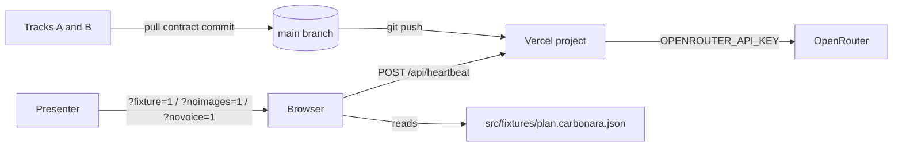
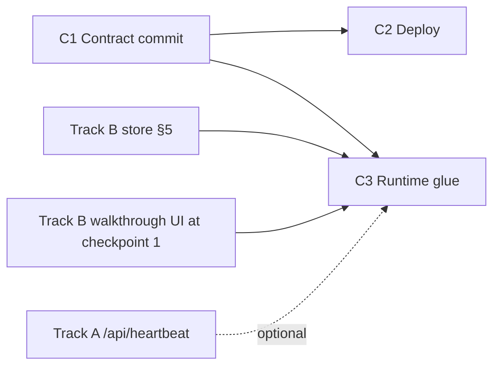

# Glue & Deploy — System Design

**Feature:** Track C of `docs/PLAN.md` §4 minus the voice work (`useJacquesVoice()`, `src/lib/realtime/**`, `/api/realtime`). Voice is a separate feature; this design defines only the boundary it plugs into.
**Sources:** `docs/PLAN.md` @ `7c9591d` (§2–§7), `docs/vision.md` @ `d832adb`, working tree @ `60cbf0d`.
**Status:** decided after two review rounds; no open decisions.

## 1. Scope and non-goals

Track C is the integration owner. This feature owns three things the other tracks cannot start or finish without:

1. The **contract commit** on `main`: shared types, the demo fixture, stub route handlers, and the model-pin file.
2. The **deployed environment**: Vercel project, env keys, and the build gate run at each checkpoint.
3. The **runtime glue** on the client: kill switches, the client bootstrap mounted from `layout.tsx`, and heartbeat check-ins delivered as a toast.

Non-goals: voice (`docs/PLAN.md` §4C bullet 3 and the "speak line via the live session" branch of bullet 4); any route handler body other than stubs and `/api/health`; any UI component; persistence, auth, Cooklang (`docs/PLAN.md` §1 "cut" row); CI beyond `pnpm build`.

## 2. System context and actors



| Actor | Role at this boundary |
| --- | --- |
| Track A (server) | Consumes `src/lib/types.ts`, `src/lib/models.ts`, fixture; replaces stub route bodies in place. |
| Track B (client) | Consumes `src/lib/types.ts`, fixture; owns `src/lib/store.ts` and the walkthrough UI that this feature's glue drives. |
| Presenter | Toggles kill switches by URL; relies on `?fixture=1` when the venue network dies. |
| Vercel | Hosts the single Next.js app; holds the OpenRouter key. |
| OpenRouter | Receives every model request from server routes; never from the browser. |

## 3. Components and responsibility boundaries

All C-owned client code lives under `src/lib/glue/**` `[PROPOSED]`, a path added to Track C's ownership column (§13) so nothing C writes lands in Track B's `src/components/**`.

| Component | Owner files | Responsibility | Not responsible for |
| --- | --- | --- | --- |
| Contract commit | `src/lib/types.ts`, `src/fixtures/plan.carbonara.json`, `src/lib/models.ts` (stub), `src/app/api/{import,images,ask,vision,heartbeat}/route.ts` (stubs) | Publish the frozen shapes from `docs/PLAN.md` §3 on `main` at T+0:15. | Prompt text, real handler logic, UI components. |
| Repository reconciliation | `src/lib/recipes.ts`, `src/lib/recipes.test.ts`, `src/app/api/recipes/**` (incl. `route.test.ts`), `src/app/page.tsx` | Remove the pre-plan recipe model so only one recipe type exists; reduce `src/app/page.tsx` to a placeholder and hand it to Track B (decision D1). | `src/app/offline/**` and `src/app/api/health/**` tests, which stay. |
| Deploy | Vercel project, `.env.example`, `src/app/api/health/route.ts` `[EXISTS]`, `pnpm build` gate | A public URL serving `main`, env keys present and reported by `/api/health`, build green at each checkpoint. | Per-route runtime behavior. |
| Kill switches | `src/lib/glue/flags.ts` `[PROPOSED]` | Parse `?fixture=1`, `?noimages=1`, `?novoice=1` once per page load into a typed `Flags` object. | What a flag means inside another track's component beyond the rules in §6. |
| Client bootstrap | `src/lib/glue/app-bootstrap.tsx` `[PROPOSED]`, mounted in `src/app/layout.tsx` `[EXISTS]` | Read flags, install the fixture plan when `fixture` is set, prewarm fixture images, then render children. | Anything rendered inside the walkthrough. |
| Heartbeat scheduler | `src/lib/glue/heartbeat-scheduler.tsx` `[PROPOSED]`, mounted by the bootstrap | Subscribe to the store's active timer; on each attention tick, obtain a line (route or fixture) and push a heartbeat card. | The route body (Track A) and the toast visuals (Track B). |
| Demo readiness | `README.md`, backup recording | Run-throughs on the demo device and network. | Not a slice — tasks in the implementation plan. |

## 4. End-to-end flow (one heartbeat)

```text
store.startTimer(sec) on a `wait` step (Track B)            [D4]
  → scheduler observes useStore(selectActiveTimer) = { stepId, startedAt, sec, generation }
  → interval = step.attentionSec ?? (step.durationSec ? step.durationSec / 3 : undefined)
     interval not finite or ≤ 0 → no heartbeat for this timer
  → every `interval` seconds while that timer stays active (n = 1, 2, 3 …), with g = generation:
       if flags.fixture === false:
         POST /api/heartbeat { stepId, elapsedSec, plan }      [docs/PLAN.md §3]
         ← 200 { line: string }
       else:
         line = step.doneWhen ? `Check: ${step.doneWhen}` : "How is it looking?"
       if selectActiveTimer(store).generation !== g → discard (stale)
       else store.pushCard({ kind: "heartbeat", stepId, line })
  → HeartbeatToast (Track B) renders the newest heartbeat card
  → timer cancelled, step changed, or startTimer called again → generation increments;
    the old schedule is cleared and any in-flight response is discarded by the check above
```

Ownership transfers at `pushCard`: after that call the line is client state owned by the store. Nothing about a heartbeat is durable; a page reload discards all timers.

## 5. Shared state and consistency

- **Single source of client state** is the Zustand store in `src/lib/store.ts` `[PROPOSED, owned by Track B]`. This feature calls actions and selectors only; it never writes store fields directly (`docs/PLAN.md` §3 "owner C only calls its actions").
- **Store boundary this feature consumes** `[PROPOSED]` — the announced additive update to the `docs/PLAN.md` §3 frozen store contract; Track B implements, this document owns the signatures:

  ```ts
  export const useStore: UseBoundStore<StoreApi<StoreState>>   // the Zustand hook; also usable as useStore.getState()
  setPlan(plan: RecipePlan): void
  pushCard(card: { kind: "heartbeat"; stepId: string; line: string }): void   // one discriminant of Track B's Card union
  selectActiveTimer(state: StoreState):
    { stepId: string; startedAt: number; sec: number; generation: number } | undefined
    // undefined when no timer is running or the running timer has expired;
    // generation increments on every startTimer, cancel, or step change
  ```

  Internal layout of `timers`, `StoreState`, and other `Card` kinds stay Track B's.
- **Flags** are immutable for the life of a page load. Changing a switch means navigating with a new query string.
- No server state exists in this feature.

## 6. Kill-switch rules (cross-track)

The root layout `src/app/layout.tsx` `[EXISTS]` is a Server Component with no access to search params, so flags are read on the client inside the bootstrap, and the bootstrap withholds its children until initialization is done. That ordering is what lets consumers assume `store.plan` is set in fixture mode.

```ts
// src/lib/glue/flags.ts  [PROPOSED] — client module
export interface Flags { fixture: boolean; noimages: boolean; novoice: boolean }
export function readFlags(search: string): Flags   // "1" | "true" → true

// src/lib/glue/app-bootstrap.tsx  [PROPOSED] — "use client"; mounted once in layout.tsx around {children}
// 1. flags = readFlags(window.location.search); publish via React context (useFlags()).
// 2. if flags.fixture: useStore.getState().setPlan(carbonaraFixture); prewarm images (below).
// 3. render children only after steps 1–2; render nothing during SSR.
export function useFlags(): Flags
```

This feature owns the flags, not the code that calls routes. Each flag is a rule any route-calling or image-rendering component must obey, whoever owns it:

| Flag | Rule at the boundary | This feature must |
| --- | --- | --- |
| `fixture` | Do not call any `/api/*` route; `store.plan` is already populated. A control whose result needs a route shows an "offline demo" placeholder instead of calling. | Install the fixture plan before children render; produce heartbeat lines locally (§4). |
| `noimages` | Render no step image regardless of `Step.imageUrl` (a live plan may already carry URLs, so stripping data is not sufficient). | Do not call `/api/images`. |
| `novoice` | `useFlags().novoice` is readable. | Do not mount the voice hook. |

Fixture mode scope: the stepped walkthrough, timers, images (D3), and heartbeat work offline. Q&A and vision do not; `docs/PLAN.md` §7 "full walkthrough with zero network" is read as that scope.

`?fixture=1` must work with the network cable pulled. `public/sw.js` `[EXISTS]` precaches only `/`, `/offline`, and the manifest; it caches navigations by full URL (query included) and static assets only when fetched under its control with an `image`/`script`/`style`/`font` destination. Two rules follow:

- **Image prewarm:** in fixture mode the bootstrap creates `new Image()` for every fixture `imageUrl` (destination `image`, so `sw.js` caches it) before rendering children. Fixture `imageUrl` values must be same-origin paths under `public/` or absent (decision D3).
- **Prewarm sequence** (part of the C3 exit test): open `/?fixture=1` online, wait for the worker to activate, reload twice, disable the network, then advance to a not-yet-viewed image-bearing step.

## 7. Failure contracts at this feature's boundaries

| Boundary | Rejects / fails when | Behavior | State left | Owner of repair |
| --- | --- | --- | --- | --- |
| `pnpm build` gate | Type error, duplicate route, broken import | Checkpoint does not pass; C reverts or reassigns the offending commit. | `main` may be red for ≤ 10 min. | Track C. |
| Vercel deploy | Build fails | Previous deployment stays live; C fixes and pushes. | Last green URL. | Track C. |
| Missing provider key | `GET /api/health` returns any `keys.*` false | Deployment is green but the C2 exit is not met; C sets the key and redeploys. | Last green URL. | Track C. |
| `POST /api/heartbeat` | Non-200, network error, > 3 s | That tick is dropped silently; no retry; the schedule continues to the next tick. | No card pushed. | None — a missed toast is acceptable. |
| Heartbeat inputs | `attentionSec`/`durationSec` missing, non-finite, or ≤ 0 | No schedule for that timer. | None. | Planner/fixture author supplies valid values. |
| Route stubs (T+0:15 to real body) | Any request | `/api/import` returns the fixture `RecipePlan` with 200; all others return 501 `{ error: "not implemented" }`. | None. | Track A replaces in place. |
| `?fixture=1` offline | Prewarm sequence (§6) not run on the demo device | Shell, bundles, or images fail to load offline. | None. | Demo run-through checklist. |

Error body for every stub this feature commits: `{ error: string }` with a 4xx/5xx status, matching `src/app/api/recipes/route.ts:12,20` `[EXISTS]` (decision D2). It binds stubs only; real route bodies are outside this feature.

## 8. Shared interfaces

| Interface | Label | Note |
| --- | --- | --- |
| `src/lib/types.ts` (`StepKind`, `Step`, `RecipePlan`, `VisionVerdict`) | `[PROPOSED]` | Verbatim from `docs/PLAN.md` §3; additive optional fields only after T+0:15. |
| `src/lib/models.ts` exporting named string ids, one per model use | `[PROPOSED]` | C commits the stub so C's own token route can import it; the key set and values are Track A's from the contract commit onward. |
| `src/fixtures/plan.carbonara.json` conforming to `RecipePlan` | `[PROPOSED]` | C commits it; Track A owns it afterwards (`docs/PLAN.md` §4A). Must include one `wait` step with `attentionSec ≤ 20` and a non-empty `doneWhen` so a heartbeat is demonstrable in under a minute. |
| Route stubs for `docs/PLAN.md` §3 lines 81–88 | `[PROPOSED]` | Stub bodies only (§7). |
| `src/lib/store.ts` `useStore`, `setPlan`, heartbeat `pushCard` discriminant, `selectActiveTimer` | `[PROPOSED, Track B implements]` | Signatures in §5. |
| `src/lib/glue/flags.ts` `readFlags`, `src/lib/glue/app-bootstrap.tsx` `useFlags` | `[PROPOSED]` | Signatures in §6. |
| `GET /api/health` `keys: { openrouter: boolean }` | `[EXISTS]` | Presence only, never values. Route reassigned to Track C (§13). |
| `.env.example` key `OPENROUTER_API_KEY` | `[EXISTS]` | Sole provider key. |
| Provider deps `ai@7`, `@openrouter/ai-sdk-provider@3`, `zod@4`, `zustand@5` | `[EXISTS]` | Direct OpenAI, Google, and fal clients removed. |
| Toolchain: `pnpm`, Next 16.3.5, Biome, Vitest | `[EXISTS]` | `docs/PLAN.md` §6/§8 say `bun`; superseded by decision D1. |
| `public/sw.js` network-first navigations, `/api/*` never cached, cache-first static assets | `[EXISTS]` | Enables the offline fixture path without changes. |

## 9. Decisions

- **D1 `[DECIDED]` Keep the existing pnpm/Biome/Vitest scaffold; do not run `create-next-app`.** Authorization: the developer committed the scaffold (`56cd31d`) and the pnpm dependency install (`60cbf0d`) after `docs/PLAN.md`. We choose it over `docs/PLAN.md` §8's fresh `bun` scaffold because the directory is non-empty and `create-next-app` aborts on it, at the accepted cost that `docs/PLAN.md` §6/§8 still read `bun` until synchronized (§13). Consequence: in the contract commit Track C deletes `src/lib/recipes.ts`, `src/lib/recipes.test.ts`, `src/app/api/recipes/**` (including its `route.test.ts`), and rewrites `src/app/page.tsx` to a placeholder that Track B then owns — so `/` never 404s and Track B edits that file in place rather than adding a colliding `(app)/page.tsx`. The `/api/health` and `/offline` tests stay.
- **D2 `[DECIDED]` Stubs use the existing `{ error: string }` shape.** We choose to match `src/app/api/recipes/route.ts` over inventing an envelope because it costs nothing and gives Track B something concrete to render at T+0:15, at the accepted cost that it binds only stubs (§7).
- **D3 `[DECIDED]` Fixture images are bundled.** The fixture references same-origin PNGs under `public/images/`, prewarmed per §6, so `?fixture=1` shows visuals offline. We choose this over an image-less offline demo because the demo's second beat is the technique image, at the accepted cost of producing 3–4 images before checkpoint 1 (Track A owns the fixture after C1; the images are part of that handoff).
- **D4 `[DECIDED]` Heartbeat fires on `wait` steps only.** `docs/PLAN.md` line 51 ties heartbeat to any `durationSec`; line 128 to `wait` steps only. We choose `wait` only because it matches the scripted demo beat and avoids toasts during knife work, at the accepted cost that a long `heat` step gets no check-in. Widening later changes only the scheduler's subscription predicate.

## 10. Slices, dependencies, and handoffs



| Slice | Entry state | Exit state (testable) | Persisted handoff |
| --- | --- | --- | --- |
| C1 Contract commit | `main` @ `60cbf0d` | `pnpm typecheck` and `pnpm build` pass; `curl -X POST /api/import` returns the fixture; other four stubs return 501 `{ error }`; recipe module gone; `/` serves the placeholder; `GET /api/health` includes `keys`. | Commit on `main`. |
| C2 Deploy | C1 on `main` | Public URL serves `/`; `GET /api/health` returns 200 with every `keys.*` true; build log green. | Vercel project + URL in README. |
| C3 Runtime glue | C1; Track B's store per §5; Track B's walkthrough UI merged at checkpoint 1 (`docs/PLAN.md` §5) | After the §6 prewarm, `?fixture=1` renders the stepped walkthrough with network disabled, including a not-yet-viewed image step; a fixture `wait` step produces a heartbeat toast at each `attentionSec` tick and stops when the step changes; `?noimages=1` shows no image on any step. | None (client-only). |

Before checkpoint 1, C3's scheduler and bootstrap can be exercised against the store alone (`useStore.getState()` in a throwaway script) and a stub `/api/heartbeat` returning a fixed line; the UI-observable exit checks run after checkpoint 1. Demo readiness (README, run-throughs, backup recording) is a task list, not a slice.

## 11. Requirement mapping

`docs/vision.md` has no requirement IDs; `docs/PLAN.md` §4C is the governing obligation list for this feature. Each maps once.

| Obligation | Source | Owner |
| --- | --- | --- |
| Scaffold and push `main` with types, fixture, stub handlers | `docs/PLAN.md` §4C bullet 1, §8 | C1 |
| Deploy to Vercel before voice work | `docs/PLAN.md` §4C bullet 2, §5 row 0:15–1:15 | C2 |
| Env keys, `.env.example`, Vercel project | `docs/PLAN.md` §4C header, bullet 5 | C2 |
| One `pnpm build` per checkpoint | `docs/PLAN.md` §6 | C2 (gate), run at C1/C3 boundaries |
| Heartbeat wiring, toast branch | `docs/PLAN.md` §4C bullet 4; `docs/vision.md` "Heart beat" | C3 |
| Kill switches `?novoice=1`, `?fixture=1`, `?noimages=1` | `docs/PLAN.md` §4C bullet 5, §7 | C3 |
| `src/app/layout.tsx` ownership | `docs/PLAN.md` §4C header | C3 (bootstrap mount) |
| Merges, demo run-through, README/pitch, backup recording | `docs/PLAN.md` §4C bullet 5, §5 rows 3:15–4:00 | Demo-readiness tasks (not a slice) |
| Voice hook, OpenRouter stream route | `docs/PLAN.md` §4C bullet 3 | Out of scope — voice feature |

## 12. Durable-direction check

The contract commit fixes `RecipePlan` as the app's recipe format. `docs/vision.md` "Ideas" lists standardizing on Cooklang; `RecipePlan` is an internal, in-memory shape with no persistence, so a later Cooklang importer can target it without a migration. Kill switches are URL-local and disposable. Nothing in this feature writes a schema, event, or external contract that outlives the session.

## 13. Parent synchronization

These are decisions this document makes (§5, §9) that `docs/PLAN.md` does not yet reflect. Slices may rely on them now; the parent should be updated to match.

- `docs/PLAN.md` §6/§8: `bun` → `pnpm` (D1).
- `docs/PLAN.md` §3 store contract: add `useStore`, `setPlan`, the heartbeat `Card` discriminant, and `selectActiveTimer` (§5).
- `docs/PLAN.md` §4 ownership: add `src/lib/glue/**` and `src/app/api/health/**` to Track C; `src/app/page.tsx` passes to Track B after C1 (D1).
