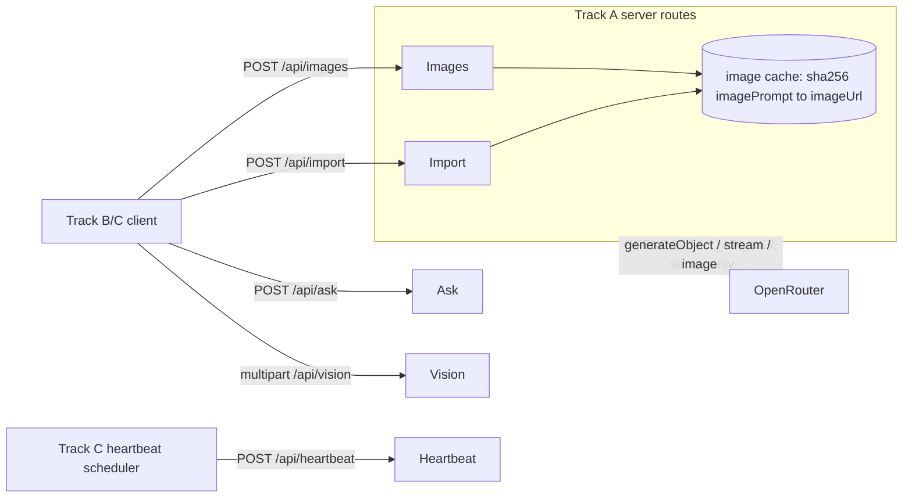
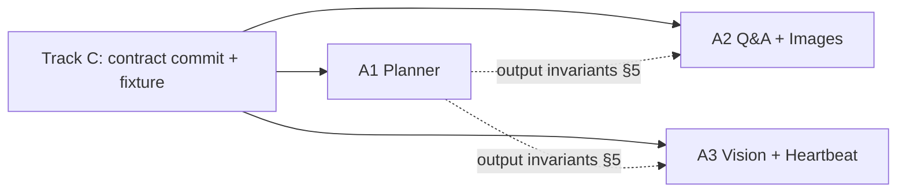

# Planner & Agent Brains — System Design

**Feature:** Track A of `docs/PLAN.md` §4A — the server-side planner and the model-backed "brains" (`/api/import`, `/api/images`, `/api/ask`, `/api/vision`, `/api/heartbeat`), their prompts, and the `src/lib/models.ts` values. Client store, UI, voice, glue, and deploy are other tracks and out of scope.
**Sources:** `docs/PLAN.md` @ `74cfc67` (§2–§7), `docs/vision.md` @ `1af11a0`, `docs/features/glue-and-deploy/system-design.md` @ `74cfc67` (the boundary Track A plugs into), working tree @ `74cfc67`.
**Status:** implemented on `main`. All five routes live against OpenRouter and curl-proven (§10 exits). Model pins chosen by measured latency: `plan`/`ask` on `openai/gpt-4.1-mini` (28 s → 11 s plan, 4.1 s → 0.8 s ask TTFB), `heartbeat` on `openai/gpt-4.1-nano` (fits the 2.5 s budget), `vision` on `openai/gpt-5-mini`. OpenAI strict structured output needs every field required, so `src/lib/schemas.ts` carries nullable model-facing mirrors (`recipePlanModelSchema`, `visionVerdictModelSchema`) that are null-stripped and re-validated against the contract schemas. D-HANDOFF still awaits Track B.

## 1. Scope and non-goals

Track A owns everything that turns a recipe and a live cook state into model output. It owns three deliverable slices:

1. **A1 Planner** — `/api/import`: URL/text → one structured `RecipePlan`.
2. **A2 Q&A + Images** — `/api/ask` (streamed answer) and `/api/images` (pre-generated technique images, cached by prompt hash).
3. **A3 Vision + Heartbeat** — `/api/vision` (strict JSON verdict) and `/api/heartbeat` (one spoken-style line).

Owned files (`docs/PLAN.md` §4A): `src/app/api/{import,images,ask,vision,heartbeat}/**`, `src/lib/prompts/**`, the *values* in `src/lib/models.ts`, and `src/fixtures/**` after Track C's contract commit.

Non-goals:

- **The frozen shapes.** `src/lib/types.ts` and the `RecipePlan`/`VisionVerdict`/`Card` definitions are the contract commit's (`docs/PLAN.md` §3); Track A consumes them and may only add optional fields by announcing (`docs/PLAN.md` §6). This document never redefines them.
- **`/api/realtime` and voice** — Track C (`docs/PLAN.md` §4C); `models.ts` `voice` value is owned here but consumed there.
- **`/api/health`** — Track C.
- **The client store, walkthrough UI, kill switches, deploy, and the heartbeat *scheduler***. Track A owns the heartbeat route *body* only; the scheduler, the ≤3 s drop rule, and the toast are Track C/B (`docs/features/glue-and-deploy/system-design.md` §4, §7).
- Persistence, auth, Cooklang, nutrition, diet variants (`docs/PLAN.md` §1 "cut" row).

## 2. System context and actors



| Actor | Role at this boundary |
| --- | --- |
| Track B/C client | Calls `/api/import`, `/api/images`, `/api/ask`, `/api/vision` with `plan`/`stepId` context; renders the results. Never holds a key. |
| Track C scheduler | Calls `/api/heartbeat` on `wait`-step attention ticks (`docs/features/glue-and-deploy/system-design.md` §4). Track A owns only the reply. |
| OpenRouter | Sole model provider; receives every request from these server routes and never from the browser (`docs/PLAN.md` §2). |
| Presenter (via kill switches) | `?fixture=1` means the client calls **no** `/api/*` route; `?noimages=1` skips `/api/images` (`docs/features/glue-and-deploy/system-design.md` §6). Track A routes must tolerate simply not being called. |

## 3. Components and responsibility boundaries

| Component | Owner files | Responsibility | Not responsible for |
| --- | --- | --- | --- |
| Planner | `src/app/api/import/route.ts`, `src/lib/prompts/plan.ts` `[PROPOSED]` | URL fetch → readable text → `generateObject` against the zod mirror of `RecipePlan`; enforce the §5 output invariants; one retry then fixture fallback. | The `RecipePlan` type; UI; image bytes. |
| Q&A | `src/app/api/ask/route.ts`, `src/lib/prompts/ask.ts` `[PROPOSED]` | Stream a ≤60-word imperative answer from `{ plan, stepId, question }` over the plain-text stream protocol (§6). | Question *card text* (planner produces the 3 suggestions per step). |
| Image pregen + cache | `src/app/api/images/route.ts`, `src/lib/images/cache.ts` `[PROPOSED]` | Generate one technique image per `imagePrompt`, dedup and store by `sha256(imagePrompt)`, return `{ [stepId]: imageUrl }`. | Deciding *which* steps get an `imagePrompt` (planner does, §5). |
| Vision | `src/app/api/vision/route.ts`, `src/lib/prompts/vision.ts` `[PROPOSED]` | Single multimodal call, photo + step context → strict `VisionVerdict` JSON, temperature 0, refuse-to-guess. | Camera capture (Track B); any agent loop. |
| Heartbeat | `src/app/api/heartbeat/route.ts`, `src/lib/prompts/heartbeat.ts` `[PROPOSED]` | `{ stepId, elapsedSec, plan }` → `{ line }` ≤20 words, spoken-style. | Scheduling, the drop-after-3 s rule, the toast (Track C/B). |
| Model pins | `src/lib/models.ts` values `[EXISTS]` | One namespaced OpenRouter id per use; a rate limit is a one-line value swap. | The key set/shape (contract commit); `voice` consumer (Track C). |

`src/lib/prompts/**` and `src/lib/images/**` are new directories inside Track A's ownership column, so nothing here lands in another track's files. Each prompt is one module; its text stays slice-local and is **not** reproduced in this document.

## 4. End-to-end flow (import through a rendered technique image)

```text
Client POST /api/import { url? | text? }                         [A1]
  → if url: fetch, extract readable text; if text: use verbatim
  → generateObject(MODELS.plan, zodRecipePlan, prompt(text))
      invalid against zod → retry once with the validation error appended
      still invalid → 200 with the committed fixture RecipePlan (fallback)   [D-FALLBACK]
  → RecipePlan satisfies the §5 invariants; imageUrl is absent on every step
  ← 200 RecipePlan
Client POST /api/images { planId, steps: [{ id, imagePrompt }] }   [A2]
  → for each step, key = sha256(imagePrompt)
      cache hit  → reuse stored imageUrl
      cache miss → generate(MODELS.image, fixed style prompt + imagePrompt)
                     provider error → fall back to MODELS.imageFallback
                     both fail      → omit that stepId from the map
      store under key in an in-process map; imageUrl = data: base64 URL (D-IMG)
  ← 200 { [stepId]: imageUrl }   (only successfully produced steps present)
Client merges imageUrl into its Step; ImagePanel fades in (Track B)
```

Nothing Track A produces is durable: `RecipePlan` is returned to the client and never re-read server-side, and the image cache is in-process (lost on cold start or redeploy). The client store is the single source of live state (`docs/features/glue-and-deploy/system-design.md` §5).

**Cross-track handoff (not Track A code).** Two client-side steps above are owned by another track: the POST to `/api/images` after `/api/import` returns, and merging the returned partial `{ stepId: imageUrl }` map into each `Step`. Track A depends on this handoff but does not own it. Owner: **Track B** (D-HANDOFF, §9), which owns the store and the `ImagePanel` that renders `imageUrl` — pending Track B/C acknowledgement. Until the merge action exists, the live P1 image path (`/api/import` → `/api/images` → rendered image) has no runner; fixture-mode images (`glue` D3) are unaffected.

## 5. Feature-wide invariant: the planner output contract

The planner is the one writer of `RecipePlan`; every other Track A brain and both other tracks *read* it. These invariants are therefore feature-wide — trusted server code may assume the **semantic** rules below without re-deriving them. This does **not** waive validation of untrusted network input: every route still structurally validates its request body and resolves `stepId` against the submitted plan at the boundary (§6, §7).

| Invariant | Consumer that depends on it | Source |
| --- | --- | --- |
| Steps ordered optimally, **mise en place first**; trivially-serial steps merged. | Walkthrough order (Track B). | `docs/PLAN.md` §4A, §3 `RecipePlan.steps` comment. |
| Every step **`id`** is non-empty and unique across the plan. | Cross-slice key: `/api/ask`, `/api/vision`, `/api/heartbeat` address a step by `id`; the `/api/images` reply is an object keyed by `id`, so a duplicate silently overwrites. | `docs/PLAN.md` §3 (`id` e.g. "s1"). |
| Every step has **exactly 3** `questions`. | Question cards (Track B), `/api/ask` context. | `docs/PLAN.md` §3, §4A. |
| Every step has a **`doneWhen`** sensory cue. | Heartbeat fallback line, vision context. | `docs/PLAN.md` §4A; `glue` §4. |
| `imagePrompt`, when present, is **content-only** — subject and action of the technique (a knife cut, a fold, a doneness state), with **no** medium, lighting, viewpoint, or background words; set only where a visual teaches. | `/api/images` prepends the fixed style (§8); competing style text breaks the locked coherent look. | `docs/PLAN.md` §4A; §2 "Style prompt is fixed". |
| `parallelWith`, when present, names **distinct existing** step ids (never the step itself). The fixture convention is symmetric (both steps list each other). | Timeline rail (Track B). | `docs/PLAN.md` §3. |
| `attentionSec` (or `durationSec`) valid and > 0 on any timed `wait` step. | Heartbeat schedule; missing/≤0 → no check-in. | `glue` §4, §7. |

A live plan that violates one of these is a planner bug, repaired in A1, not worked around downstream. The fixture (owned by A after C1) must satisfy the same invariants so fixture-mode and live-mode behave identically.

## 6. Trust and compatibility boundaries

- **Key isolation.** Every route reads `OPENROUTER_API_KEY` from the server env and proxies through `@openrouter/ai-sdk-provider` `[EXISTS]`; no route returns the key, echoes provider errors verbatim to the client, or is reachable with client credentials. This is one of two server-side trust boundaries; the import URL fetch is the other.
- **Untrusted request input.** Request bodies (`plan`, `stepId`, `question`, `imagePrompt`s, the vision multipart) arrive from the browser and are untrusted despite their TypeScript types. Every route structurally validates its body (a zod parse) and, where it addresses a step, confirms `stepId` resolves in the submitted plan **before** any provider call; a failure returns the common `{ error }` 400 (§7). Interfaces express shape, not trust.
- **Import URL-fetch policy (SSRF).** `/api/import` fetches a user-supplied URL, so it MUST allow only `http`/`https`, reject embedded credentials, and reject targets resolving to loopback, link-local, or private ranges; every redirect hop is re-checked under the same rule. A rejected URL returns the common `{ error }` 400 before any fetch. Paste is the primary demo input (`docs/PLAN.md` §7); URL is a bonus, so this policy costs one guard, not a feature.
- **Streamed answer protocol.** `/api/ask` responds `Content-Type: text/plain; charset=utf-8`, chunked, each chunk a raw UTF-8 fragment of the answer, terminated by end-of-body (`ai@7` `streamText(...).toTextStreamResponse()`). No Server-Sent-Events or data-stream framing. An error detected before the first byte returns a JSON `{ error }` with a 4xx/5xx status; an error after streaming starts closes the body early (§7).
- **Wire-shape stability.** The five route response shapes (`docs/PLAN.md` §3 API table) are consumed by Tracks B/C. They change only additively and only by announcing (`docs/PLAN.md` §6). `imageUrl` is already optional on `Step`, which is what lets `/api/images` return a partial map (§7) without a contract change.
- **Model swap surface.** `src/lib/models.ts` values are the only place a provider id appears; swapping a rate-limited model is a one-line value edit that no other file observes.

## 7. Failure contracts at Track A's boundaries

| Boundary | Rejects / fails when | Behavior | State left | Owner of repair |
| --- | --- | --- | --- | --- |
| `POST /api/import` | URL rejected by the SSRF policy (§6), unfetchable, or JS-rendered | If `text` was also sent, use it; else 400 `{ error }`. Paste is the primary path (`docs/PLAN.md` §7). | None. | A1. |
| `POST /api/import` | `generateObject` output fails the zod schema | One retry with the validation error appended; still failing → 200 with the fixture plan (D-FALLBACK). | None (stateless). | A1. |
| `POST /api/images` | One `imagePrompt` fails on both primary and fallback model | That `stepId` is **omitted** from the map; other steps still return. Never blocks a step render — `imageUrl` is optional. | Successful images cached; failed one absent. | A2 (ret/re-request). |
| `POST /api/images` | Client sent `?noimages=1` context | Route simply is not called; if called, it still behaves normally (flag is a client rule). | Per success/failure above. | Client (Track B/C). |
| `POST /api/ask` | Provider/stream error mid-answer | Close the stream; client shows the partial text. No retry. | None. | A2. |
| `POST /api/vision` | Photo unclear/ambiguous | Return `{ status: "off", observed, fix: "retake closer" }` at temperature 0 — **refuse to guess** (`docs/PLAN.md` §4A). | None. | A3. |
| `POST /api/vision` | Non-image or missing `stepId`/`plan` part | 400 `{ error }`. | None. | A3. |
| `POST /api/ask` | Body fails structural validation, or `stepId` not in `plan` | 400 `{ error }` before streaming; no provider call. | None. | A2. |
| `POST /api/images` | Body fails structural validation | 400 `{ error }`. Per-prompt model failure is the row above, not this. | None. | A2. |
| `POST /api/heartbeat` | Body fails structural validation, or `stepId` not in `plan` | 400 `{ error }`. | None. | A3. |
| `POST /api/heartbeat` | Provider slow/errors | Return promptly with a plausible `{ line }` or a non-200; the scheduler drops any tick over 3 s regardless (`glue` §7). Track A adds no retry. | None. | None — a missed toast is acceptable. |

Error body for every 4xx/5xx: `{ error: string }`, matching the stubs already on `main` (`glue` §7, D2).

## 8. Concurrency and the image cache

- **Pregen is client-driven, not fire-and-forget.** `docs/PLAN.md` §4A says "fire it async right after plan generation," but Next on Vercel kills work after the response returns unless deferred; the **authoritative** path is the separate `/api/images` call the client makes after import. `/api/import` MAY warm the cache via `waitUntil`, but correctness never depends on it.
- **Dedup by content hash, coherence bounded by backend.** `sha256(imagePrompt)` is the cache key: within one warm instance a repeated key reuses the stored result and concurrent same-key requests single-flight. Across instances the guarantee is only best-effort — the decided in-process backend (D-IMG 1a) may regenerate the same key on a cold instance, which is harmless for a single demo. The A2 cache-hit exit (§10) is therefore stated per warm instance.
- **Fixed style prompt.** A constant style preamble (clean instructional sketch, white background, top-down; `docs/PLAN.md` §2) is prepended to every image so the set is visually coherent; it lives in Track A's image module, not the plan. This is why `imagePrompt` must be content-only (§5) — style words in the prompt fight the preamble.

## 9. Decisions

- **D-FALLBACK `[DECIDED]` Schema failure falls back to the committed fixture, not an error.** `docs/PLAN.md` §7 ("zod + one retry … fixture fallback") governs. Cost: a live import that fails twice silently shows carbonara; acceptable for a demo, and the retry makes it rare.
- **D-STYLE `[DECIDED]` One fixed image style prompt.** Per `docs/PLAN.md` §2, to keep the pregenerated set coherent. Reversible — it is a single constant in the image module.
- **D-IMG `[DECIDED]` In-process image cache, `imageUrl` as a `data:` base64 URL.** `docs/PLAN.md` §4A said "on-disk/blob cache," but on Vercel serverless the filesystem is read-only except per-lambda `/tmp`, which is neither shared across lambdas nor web-servable, so on-disk survives neither the import→images→browser hops nor a cold start. The cache is therefore an in-process map keyed by `sha256(imagePrompt)` (storage **1a**: a warm instance dedupes; a cold instance may regenerate, harmless for one demo, with no cross-lambda single-flight), and each image returns inline as a `data:` base64 URL (transport **2a**: no serving infra or new env). Considered and deferred: a shared **Vercel Blob** store (1b) with a public URL (2b), which dedupes globally but needs `BLOB_READ_WRITE_TOKEN` (Track C's env). Both choices sit behind `src/lib/images/cache.ts`, so moving to 1b/2b later touches no other slice or track — the `sha256` key and the optional `imageUrl` field are the seam.
- **D-HANDOFF `[DECIDED, pending B/C ack]` Track B owns the live image trigger and merge.** The post-import `/api/images` call and merging its partial `{ stepId: imageUrl }` map into each `Step` are client work (§4); assigned to **Track B** because it owns the store (`setPlan` / an image-merge action) and the `ImagePanel` that renders `imageUrl`. Track A cannot satisfy this alone and needs Track B/C to acknowledge the assignment; without it the live P1 image beat has no runner (fixture images unaffected, `glue` D3).

## 10. Slices, dependencies, and handoffs



All three A slices depend only on the **contract commit** (frozen types + fixture, already on `main`), not on each other's live output — A2 and A3 are built and tested against the fixture `RecipePlan`. The dashed edges are the §5 invariant contract, not a blocking handoff.

| Slice | Entry state | Exit state (testable) | Persisted handoff |
| --- | --- | --- | --- |
| A1 Planner | Contract commit on `main`; fixture ownership transferred from Track C (`glue` D3, incl. fixture technique images). | `curl -X POST /api/import` with a pasted recipe returns a `RecipePlan` that passes the §5 invariants (mise-en-place-first, 3 questions each, `doneWhen` each, `imagePrompt` only where teaching); a schema failure returns the fixture. Real JSON pasted in chat (`docs/PLAN.md` §4A proof). | None (stateless response). |
| A2 Q&A + Images | Contract commit; D-IMG resolved (in-process cache + `data:` URLs, §9). | `curl /api/ask` streams a ≤60-word imperative answer (`text/plain`, §6) for a fixture step+question, and a body with an unknown `stepId` returns 400 before streaming; `curl /api/images` with two fixture `imagePrompt`s returns a `{ stepId: imageUrl }` map, an immediate repeat against the same warm instance is a cache hit (same key, no regeneration), a bad prompt is omitted not fatal. | Image cache keyed by `sha256(imagePrompt)`. |
| A3 Vision + Heartbeat | Contract commit; a demo photo. | `curl /api/vision` (photo + fixture step) returns strict `VisionVerdict` JSON, and an unclear photo returns `status:"off"` with a retake `fix`; `curl /api/heartbeat` returns `{ line }` ≤20 words. | None. |

Prompt tuning on the real demo recipe (`docs/PLAN.md` §5 row 2:15–3:15) is a task inside A1/A3, not a slice.

**External handoff this feature depends on.** The live image path needs a client-side owner for the post-import `/api/images` call and the partial-map merge into `Step` (§4). This is not Track A code; owner **Track B** (D-HANDOFF, §9), pending Track B/C acknowledgement. It is a prerequisite for the P1 image beat running end to end, tracked here because Track A cannot satisfy it alone.

## 11. Requirement mapping

`docs/vision.md` has no requirement IDs; `docs/PLAN.md` §4A is the governing obligation list. Each maps once.

| Obligation | Source | Owner slice |
| --- | --- | --- |
| Recipe → optimal task series (`RecipePlan` generation, invariants) | `docs/PLAN.md` §4A bullet 1; `docs/vision.md` "converts to … tasks" | A1 |
| `/api/ask` streamed Q&A | `docs/PLAN.md` §4A bullet 2; `docs/vision.md` "suggested question cards" | A2 |
| Image pregen + `sha256(imagePrompt)` cache | `docs/PLAN.md` §4A bullet 3; `docs/vision.md` "Generates visuals" | A2 |
| `/api/vision` strict JSON verdict, refuse-to-guess | `docs/PLAN.md` §4A bullet 4; `docs/vision.md` "Vision mode" | A3 |
| `/api/heartbeat` spoken-style line | `docs/PLAN.md` §4A bullet 5; `docs/vision.md` "Heart beat" | A3 |
| Prompts and model ids live only in Track A | `docs/PLAN.md` §6 | A1–A3 (`src/lib/prompts/**`, `src/lib/models.ts` values) |
| `curl`-proof per route | `docs/PLAN.md` §4A "Deliverable proof" | Each slice exit (§10) |
| Voice / `/api/realtime` | `docs/PLAN.md` §4C | Out of scope — voice feature |

## 12. Durable-direction check

`docs/vision.md` durable goals served here: "converts [a recipe] to an optimal series of tasks" (A1), on-the-fly technique visuals (A2), question-card Q&A (A2), vision feedback (A3), and heartbeat check-ins (A3) — five of the six product features, all leaf model calls behind a JSON plan (`docs/PLAN.md` §2), which keeps the walkthrough deterministic and testable.

`docs/vision.md` "Ideas" names standardizing on **Cooklang**. `RecipePlan` stays an internal, in-memory shape with no persistence, so a future Cooklang importer targets it without a migration — the planner boundary (`/api/import` in, `RecipePlan` out) is exactly where that swap would land. The only cache is an in-process map keyed by a content hash behind `src/lib/images/cache.ts` (D-IMG); by design it does not survive a cold start or redeploy, and it is reversible to a shared store (Vercel Blob) without touching another slice. Nothing here writes a schema, event, or external contract that outlives the session.
