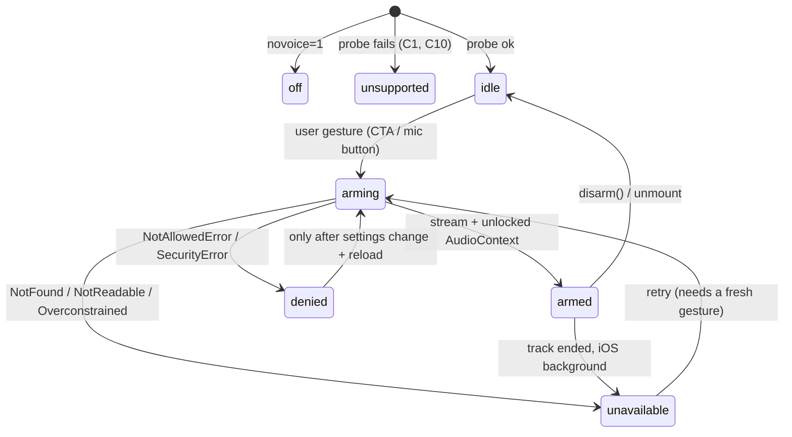

# Voice Startup Activation — Plan

**Feature:** the slice of Track C voice work between page load and the first moment Jacques can legally *hear* and *be heard*. Owns the gate, the permission lifecycle, and the failure ladder. Does **not** own the turn loop, `/api/realtime`, SSE tool events, or Watch Me's camera.
**Sources:** `docs/PLAN.md` @ `3eac016` (§2 Voice, §4C, §7), `docs/WATCH_ME_PLAN.md` @ `3eac016` (transport split, kill switches), working tree @ `3eac016`.
**Status:** proposed. `src/lib/realtime/**` and `src/app/api/realtime/**` do not exist yet; this is the first file in that column.

## 1. The one-line answer

**Voice cannot auto-start on load, and we will not try.** Startup runs a zero-cost capability probe that touches no device. One user gesture — the existing "Start cooking" CTA — arms *both* directions in a fixed order (unlock audio output synchronously, then request the microphone), and the resulting `MediaStream` is held for the whole session instead of re-acquired per turn.

Everything below is the justification, the state machine, and the failure ladder.

## 2. Constraints that force this shape

| # | Constraint | Consequence for us |
| --- | --- | --- |
| C1 | `navigator.mediaDevices` is `undefined` outside a secure context (HTTPS; `localhost` exempt). | Phone testing over `http://192.168.x.x:3000` has **no microphone at all** — not a prompt, a missing API. Test and demo from the Vercel HTTPS URL (or a tunnel), never a LAN IP. |
| C2 | Audio *output* needs a user gesture. Safari requires a gesture for any audio playback, and **the user's answer to the permission prompt does not itself count as a gesture**. A fresh `AudioContext` starts `suspended`. | Unlock output *first and synchronously*, in the same handler, **before** the `await` on `getUserMedia`. Getting the mic does not buy us the speaker. |
| C3 | Audio *input* prompts are gesture-gated in Safari and effectively gesture-gated in Chromium (prompts raised without activation get auto-dismissed; repeated dismissals become a sticky origin block). | Never call `getUserMedia` from a mount effect. One prompt, at a moment the user has already chosen to cook. |
| C4 | Permission persistence is not portable. Chromium persists `granted` per HTTPS origin. **iOS Safari does not** — it re-requests on essentially every page load, and re-prompts intermittently on SPA route/hash changes. | Acquire **once per app load** and hold the stream. Per-turn re-acquisition would re-prompt mid-demo on the most likely demo device. |
| C5 | `navigator.permissions.query({ name: "microphone" })` is supported by Chromium and Safari 16+, but **Firefox throws `TypeError`** on that name. | It is a UI hint only (label the button "Voice ready" vs "Enable voice"). Wrap in `try/catch`, treat unknown as `"prompt"`, and never gate readiness on it. |
| C6 | iOS home-screen PWAs in `display: "standalone"` have a long tail of `getUserMedia` defects (WebKit [185448](https://bugs.webkit.org/show_bug.cgi?id=185448), [215884](https://bugs.webkit.org/show_bug.cgi?id=215884)): prompt silently never appears, or repeats on hash change. `src/app/manifest.ts` ships `display: "standalone"`. | Verify the mic inside the **installed icon** on the actual demo phone by T+2:15. If it fails, demo from a Safari tab — that is a zero-code fallback. Do **not** change `display` after feature freeze. |
| C7 | The OS sits above the browser: macOS "Microphone" privacy denial surfaces as `NotAllowedError` even when the site permission is granted. | Recovery copy must mention System Settings, not just the browser. Check the demo laptop before T+3:15. |
| C8 | Permissions-Policy defaults to `microphone=(self)`; a cross-origin iframe needs an explicit `allow="microphone"`. | Present from a real tab. Do not demo through an embedding dashboard/preview frame. |
| C9 | iOS suspends capture when the tab hides or the screen locks; tracks can end or mute. | Screen Wake Lock while armed; re-arm on `visibilitychange` + `track.onended`. |
| C10 | `MediaRecorder` codec support differs (Chromium: `audio/webm;codecs=opus`; Safari: `audio/mp4`). | Probe with `MediaRecorder.isTypeSupported` during the **free** Tier-0 probe so an unsupported container fails at startup, not at the first turn. |
| C11 | Jacques' own voice leaks into an open mic. | `echoCancellation: true` plus a half-duplex gate (capture disabled while playback runs) for the POC. |

Non-constraint, verified: `public/sw.js` already returns early for non-`GET` and for `/api/*`, so the service worker will not intercept `/api/realtime`. No change needed.

## 3. State machine

```ts
// src/lib/realtime/types.ts
export type VoiceState =
  | "off"          // ?novoice=1 — nothing mounts, no device touched
  | "unsupported"  // C1/C10: insecure context, no mediaDevices, no usable recorder mime
  | "idle"         // capable, not yet armed — the CTA can arm
  | "arming"       // gesture in flight: output unlocked, prompt open
  | "armed"        // stream held, output unlocked — turn loop may run
  | "denied"       // user or OS said no; recoverable only via browser/OS settings
  | "unavailable"; // device busy/absent/ended — retryable
```



`denied` is terminal for the page load. No auto-retry loops — a second uninvited prompt is what makes Chromium block the origin permanently (C3).

## 4. Cold start (T+0, zero device access)

`src/app/layout.tsx` → `AppBootstrap` already withholds children until flags resolve, so the voice provider mounts *after* `?novoice=1` is known and never races it.

```text
AppBootstrap effect (existing)                       [src/lib/glue/app-bootstrap.tsx]
  └─ readFlags(window.location.search)
       └─ <VoiceSession> mounts inside FlagsContext   [src/lib/realtime/voice-session.tsx]
            └─ probeVoiceCapability(flags)            pure, synchronous, no await
                 ├─ flags.novoice            → "off"
                 ├─ !window.isSecureContext  → "unsupported" (C1)
                 ├─ !navigator.mediaDevices?.getUserMedia → "unsupported"
                 ├─ no AudioContext          → "unsupported"
                 ├─ no supported recorder mime (C10)      → "unsupported"
                 └─ else                     → "idle"
            └─ optional hint: permissions.query in try/catch (C5) → button copy only
```

Cost of a cold start: no network, no device, no recording indicator, no quota burn. This satisfies `docs/PLAN.md` §7 "start on click only".

## 5. The arm gesture (the only place permission is requested)

Ordering is load-bearing — C2 means output must be unlocked while the activation is still live.

```ts
// src/lib/realtime/audio-unlock.ts
/** MUST be called synchronously inside a user-gesture handler, before any await. */
export function unlockOutput(): AudioContext {
  const ctx = new (window.AudioContext ?? window.webkitAudioContext)();
  void ctx.resume();
  const source = ctx.createBufferSource();
  source.buffer = ctx.createBuffer(1, 1, 22_050); // 1-frame silent buffer
  source.connect(ctx.destination);
  source.start(0);
  return ctx;
}
```

```ts
// src/lib/realtime/voice-session.tsx (excerpt)
async function arm(): Promise<VoiceState> {
  const ctx = unlockOutput();                     // 1. output, synchronous (C2)
  setState("arming");
  try {
    const stream = await navigator.mediaDevices.getUserMedia({
      audio: {                                    // 2. input, audio only — never {audio, video}
        echoCancellation: true,                   //    camera is a separate prompt at Watch Me
        noiseSuppression: true,
        autoGainControl: true,
        channelCount: 1,
      },
    });
    for (const track of stream.getAudioTracks()) track.enabled = false; // idle between turns (C11)
    hold(stream, ctx);
    return "armed";
  } catch (error) {
    void ctx.close();
    return classify(error);                       // §7
  }
}
```

**Where the gesture lives.** The arm point is the walkthrough's existing primary CTA ("Start cooking"), not a dedicated "allow microphone" button: one prompt, at the moment intent is already expressed, with the recipe on screen so the permission sheet has context. Secondary arm points, each its own gesture: the mic button on the step card (for users who declined at start) and Watch Me (camera, prompted separately and later — never two prompts in one gesture).

## 6. Module boundary and public contract

Track C owns every file here (`docs/PLAN.md` §4C). Track B renders the affordances and calls the hook; **Track B never calls `getUserMedia` itself.**

| File | Owner | Responsibility |
| --- | --- | --- |
| `src/lib/realtime/capabilities.ts` | C | `probeVoiceCapability(flags)` — pure, sync, no device access. |
| `src/lib/realtime/audio-unlock.ts` | C | `unlockOutput()` — the synchronous autoplay unlock. |
| `src/lib/realtime/voice-session.tsx` | C | `"use client"` provider: state machine, stream lifetime, visibility/wake-lock handling, `useVoice()`. |
| `src/lib/glue/app-bootstrap.tsx` | C | mounts `<VoiceSession>` inside `FlagsContext`, beside `<HeartbeatScheduler>`. |
| `src/components/**` | **B** | mic chip, arm CTA state, denied/unsupported copy. Consumes `useVoice()` only. |

```ts
// src/lib/realtime/voice-session.tsx — the contract Track B codes against
export interface VoiceHandle {
  state: VoiceState;
  failure?: VoiceFailure;              // §7 — drives the recovery copy
  arm(): Promise<VoiceState>;          // MUST be called from a user-gesture handler
  disarm(): void;                      // stops tracks, closes the AudioContext
  stream(): MediaStream | undefined;   // consumed by the turn loop, not by UI
  output(): AudioContext | undefined;  // consumed by SSE audio playback
}
export function useVoice(): VoiceHandle;
```

The turn loop (`useJacquesVoice()`, `/api/realtime`) is a later slice and consumes `stream()`/`output()`; it must assume `state === "armed"` and never arm on its own.

## 7. Failure contract

`classify(error)` maps `DOMException.name` once, so every surface renders the same copy.

| Error / condition | State | UI copy (Track B) | Recovery |
| --- | --- | --- | --- |
| `NotAllowedError`, `SecurityError` | `denied` | "Jacques can't hear you. Allow the mic in your browser settings, then reload." | Site settings → reload. On macOS also System Settings → Privacy → Microphone (C7). |
| `NotFoundError` | `unavailable` | "No microphone found." | Plug in / select a device, tap to retry. |
| `NotReadableError` | `unavailable` | "Your mic is in use by another app." | Close the other app (Zoom/Meet/another tab), tap to retry. |
| `OverconstrainedError` | `unavailable` | "Mic settings aren't supported." | Retry with `{ audio: true }` bare constraints once, then give up. |
| `AbortError`, track `ended`/`mute` (C9) | `unavailable` | "Voice paused." | Re-arm on next gesture or on `visibilitychange` → visible. |
| Insecure origin / missing API (C1) | `unsupported` | "Voice needs the HTTPS link." | Use the deployed URL. |
| No supported recorder mime (C10) | `unsupported` | "Voice isn't supported in this browser." | Use Chrome/Safari. |

In every non-`armed` state the walkthrough is fully usable: step cards, timers, images, question cards, camera verdict, and the heartbeat **toast** branch (already implemented in `src/lib/glue/heartbeat-scheduler.tsx`). Voice speaking the heartbeat line is the `armed`-only upgrade described in `docs/PLAN.md` §4C.

## 8. Session lifetime

- **Hold one stream for the session** `[DECIDED]`. We choose hold-and-mute (`track.enabled = false` between turns) over acquire-per-turn because per-turn acquisition costs 150–400 ms of dead air before every answer and, on iOS, risks a fresh prompt mid-demo (C4). Accepted cost: the browser's recording indicator stays lit for the whole session — we make that legible with a persistent mic chip in the UI rather than hiding it.
- **Wake Lock while armed.** `navigator.wakeLock.request("screen")` inside the arm gesture; release on `disarm()`. A phone propped against a bowl that sleeps mid-step kills both the demo and the product story. Feature-detect; failure is non-fatal.
- **Visibility.** On `visibilitychange` → hidden, disable tracks and suspend the `AudioContext`. On → visible, if any track is `ended`, drop to `unavailable` and require a gesture; do not silently re-prompt.
- **Teardown.** `disarm()` stops all tracks, closes the `AudioContext`, releases the wake lock; the provider's unmount cleanup calls it. This also fixes the dev hazard where Fast Refresh leaks a live mic per reload, and it is why `?novoice=1` never even mounts the provider.

## 9. Kill switch and degradation ladder

1. `?novoice=1` → probe returns `off`, provider mounts nothing, no arm affordance rendered, zero device access. (Existing flag, `src/lib/glue/flags.ts`.)
2. `unsupported` / `denied` / `unavailable` → silent-Jacques mode: full visual walkthrough, question cards for Q&A, heartbeat toasts.
3. `armed` but the turn loop fails → that is the turn loop's contract, not this one; the gate stays `armed`.

## 10. Slices

| Slice | Content | Exit (observable) |
| --- | --- | --- |
| **V0** | `capabilities.ts` + `types.ts`; `<VoiceSession>` mounted; `useVoice()` returns `idle`/`off`/`unsupported`; dev-only `window.__jacquesVoice` handle mirroring the `__jacques` store handle in `app-bootstrap.tsx`. | On the deployed URL, `__jacquesVoice.state` reads `idle`; `?novoice=1` reads `off`; a LAN-IP load reads `unsupported`; no permission prompt has appeared in any of the three. |
| **V1** | `audio-unlock.ts` + `arm()` + `classify()`; Track B wires the CTA. | Tap CTA → one prompt → `armed`; a 300 ms test tone plays through the unlocked `AudioContext` on iOS Safari. Deny → `denied` + copy. |
| **V2** | Lifetime: hold/mute, wake lock, visibility, teardown. | Background the tab and return: state is correct, no duplicate prompt, no leaked indicator after `disarm()`. |
| **V3** | Hand-off: turn loop consumes `stream()`/`output()`; heartbeat speaks when `armed`. | Out of scope here — listed so the boundary is explicit. |

V0+V1 fit the `docs/PLAN.md` §5 "mic → audio round trip proven" row (0:15–1:15); V2 belongs in the 2:15–3:15 "fallbacks, mobile layout, kill switches" row.

## 11. Verification matrix

Every cell is a manual check on a real surface — no unit test proves a permission prompt.

| Surface | Must verify |
| --- | --- |
| Demo laptop, Chrome, deployed HTTPS | Arm on first click; reload → no second prompt (C4); OS-level mic enabled (C7). |
| iPhone Safari tab, deployed HTTPS | Gesture-arm works; test tone audible (C2); expect a prompt on each load. |
| iPhone **installed** PWA icon | The C6 check. If the prompt never appears, demo from the tab and say so in the run sheet. |
| Android Chrome | Arm + tone. |
| `?novoice=1` | No mic affordance, no prompt, walkthrough intact. |
| Denied path | Block mic in site settings → `denied` copy renders, app still fully usable. |
| LAN IP (`http://…`) | `unsupported` renders rather than a crash — proves C1 handling. |

## 12. Risks

| Risk | Pre-mitigation |
| --- | --- |
| Prompt appears during the pitch and derails timing | Arm at the CTA, which happens during the *setup* beat of the demo, and pre-grant on the demo device before the run-through. |
| Presenter reloads mid-demo on iOS and re-prompts | Run sheet rule: do not reload after arming; `?fixture=1` navigations keep the same document. |
| Installed-PWA mic broken on the demo phone (C6) | Verified at T+2:15; fallback is the Safari tab, zero code change. |
| Origin permanently blocked by earlier dismissals during dev | Use a dedicated Chrome profile for demo run-throughs; check `permissions.query` state before going on stage. |
| Jacques hears himself and interrupts himself | `echoCancellation` + half-duplex gate (C11); wired headset is the stage fallback already named in `docs/PLAN.md` §7. |

## 13. Parent synchronization

If accepted, sync three lines outward:

- `docs/PLAN.md` §4C bullet 3 — note that `useJacquesVoice()` consumes an already-armed session and never calls `getUserMedia` itself.
- `docs/PLAN.md` §7 — add the "arm at the CTA, hold the stream, no reload after arming" rule beside the existing mic risk row.
- `README.md` — add the demo-surface caveat (deployed HTTPS only; installed-PWA mic verified separately).
