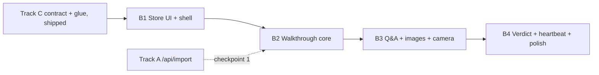

# Track B — Walkthrough UI & Generative UI: Implementation Plan

**Scope:** `docs/PLAN.md` §4 Track B — `src/app/page.tsx`, `src/components/**`, `src/lib/store.ts`, Tailwind/global styles.
**Sources:** `docs/PLAN.md` §1–§7, `DESIGN.md` (visual source of truth), `docs/features/glue-and-deploy/system-design.md` (Track C boundary, now implemented on `main`), CopilotKit onboarding (managed Intelligence integration).
**Rule of the build:** the walkthrough is deterministic — it renders from `RecipePlan` (the frozen backbone). CopilotKit generative UI covers the *conversational* surfaces only: streamed Q&A answers, the vision verdict card, the heartbeat line, and agent-invoked UI control. The agent selects and fills typed components; it never emits markup (`docs/PLAN.md` §2).
**Reconciled 2026-09-12:** merged `origin/main` (10 commits — contract commit, kill switches, heartbeat glue, Cooklang samples, review fixes, and a project-wide cutover to a single `OPENROUTER_API_KEY`). Sections below are updated to match what actually shipped: no `(app)` route group exists (single `src/app/page.tsx`), the real `store.ts`/`flags.ts`/`app-bootstrap.tsx` contracts, and OpenRouter as the sole model vendor.

---

## 0. Foundation — CopilotKit wiring (build this first)

Decisions already made at setup (2026-09-12): **Built-in CopilotKit agent** (`BuiltInAgent` runs inside the CopilotKit Runtime in this Next.js app — no separate agent server), managed project **`jacques`** (slug recorded in `.copilotkit/project.json`), Intelligence key `CPK_INTELLIGENCE_API_KEY` already in `.env` (git-ignored, verified).

**Superseded by the merge, then corrected by `integration-plan.md` §7.3:** the original setup wizard picked OpenAI directly and had the developer add `OPENAI_API_KEY` to `.env`. `origin/main` has since cut the whole project over to a single `OPENROUTER_API_KEY` (`docs/PLAN.md` §2, `src/lib/models.ts`, `.env.example`). Building the agent's model with `@openrouter/ai-sdk-provider` is **not** possible, though: `@copilotkit/runtime@1.71.1` depends on `ai@^6` (`@ai-sdk/provider@3.x`) while this repo and that provider are on `ai@7` (`@ai-sdk/provider@4.x`) — a provider-spec major apart. The runtime resolves its own `"provider/model"` strings through its bundled `@ai-sdk/openai` (`resolveModel` → `createOpenAI({ apiKey, baseURL: process.env.OPENAI_BASE_URL })`), so the single-credential rule is kept with the string form instead (0.4). **Action before the next build session:** add `OPENROUTER_API_KEY` and `OPENAI_BASE_URL=https://openrouter.ai/api/v1` to `.env`; the stray `OPENAI_API_KEY` is unread and can be removed.

| # | Step | Files | Validation |
| --- | --- | --- | --- |
| 0.1 | Add `@copilotkit/react-core` + `@copilotkit/runtime` (latest; no existing dependency moves — `@openrouter/ai-sdk-provider` is already installed; revert = restore `package.json` + lockfile and reinstall) | `package.json`, `pnpm-lock.yaml` | `pnpm install && pnpm typecheck` |
| 0.2 | Document `CPK_INTELLIGENCE_API_KEY` alongside the existing `OPENROUTER_API_KEY` | `.env.example` | — |
| 0.3 | Add an `agent` model id to the existing pin map, reusing the project's OpenRouter model choice (`MODELS.agent = "openai/gpt-5-mini"`, same as `ask`) — additive, announce to Track A before landing | `src/lib/models.ts` *(edit)* | `pnpm typecheck` |
| 0.4 | Runtime route: `new BuiltInAgent({ model: `openai/${MODELS.agent}`, apiKey: process.env.OPENROUTER_API_KEY!, prompt: systemPrompt, maxSteps: 4 })` — the leading `openai/` selects the provider, the rest stays the full OpenRouter id; `OPENAI_BASE_URL` points at OpenRouter. `maxSteps` **must** be raised from its default of `1`, or the agent emits a tool call and never speaks after it. Then `CopilotRuntime({ agents: { default: builtInAgent }, intelligence: new CopilotKitIntelligence({ apiKey: process.env.CPK_INTELLIGENCE_API_KEY! }), identifyUser })` + `createCopilotRuntimeHandler({ runtime, basePath: "/api/copilotkit" })`, export GET+POST. `identifyUser` is **required**. All imports from `@copilotkit/runtime/v2`. | `src/app/api/copilotkit/[[...slug]]/route.ts` *(new)* | `curl localhost:3000/api/copilotkit/info` returns agent metadata |
| 0.5 | Client `Providers`: `CopilotKitProvider runtimeUrl="/api/copilotkit"` (omit `useSingleEndpoint` — auto transport) + `import "@copilotkit/react-core/v2/styles.css"`; mount **inside** `AppBootstrap`'s children in root layout, so `useStore`/`useFlags` and CopilotKit hooks are both available to `page.tsx` | `src/components/providers.tsx` *(new)*, `src/app/layout.tsx` *(edit — one added wrapper line around `{children}`)* | Inspector button appears in dev build |
| 0.6 | Agent bridge: `useAgentContext` ×2 + `useFrontendTool` ×3 (`integration-plan.md` §6) | `src/lib/hooks/use-agent-bridge.ts` *(new)*, `src/app/page.tsx` *(edit)* | Inspector → Frontend Tools lists `highlight_step`, `start_timer`, `show_heartbeat` |

The runtime route and `models.ts` sit in Track A/C territory; everything from §1 down is Track B. The system prompt on `BuiltInAgent` (Track A) must name those three tools — the model only calls tools the prompt names. How every component actually receives its data — hook signatures, cancellation, fallbacks, failure states — is `docs/features/walkthrough-ui/integration-plan.md`.

---

## 1. Component inventory (all under `src/components/`)

Every visual rule below is normative from `DESIGN.md` §2–§7; this table only maps components to contracts.

| Component | File | Renders | Key contract |
| --- | --- | --- | --- |
| `AppShell` | `app-shell.tsx` | 640px max column, safe-area padding, Cast Iron bg | Rendered inside the root layout (no nested route group); portrait-first always (`DESIGN.md` §5). |
| `ImportForm` | `import-form.tsx` | URL input + textarea paste path + submit | Textarea is the primary demo input (`docs/PLAN.md` §7). On submit: `POST /api/import` → `store.setPlan()`; `page.tsx` re-renders the walkthrough in place (no navigation). `?fixture=1` never reaches this component — `AppBootstrap` already populated `store.plan` before children rendered. |
| `Timeline` | `timeline.tsx` | Dot per step + hairline + mono `3 / 9` counter | Herb done / Ember ring current / Stone hollow upcoming; Ember pulse on current dot (perpetual micro-loop). Taps call `store.goto(i)`. |
| `StepCard` | `step-card.tsx` | One skeleton, kind expressed by uppercase chip + line icon top-left | `kind: StepKind` → chip label + icon only, never background color (`DESIGN.md` §4). Title `clamp(2rem,7vw,3.25rem)`, detail ≤ 65ch, `doneWhen` cue in Stone Gray, `tools`/`ingredients` chips. |
| `StepKindIcon` | `step-kind-icon.tsx` | Line icon per `prep/heat/wait/combine/plate/check` | No emoji anywhere (`DESIGN.md` §7). Inline SVG strokes, 24px grid. |
| `ImagePanel` | `image-panel.tsx` | 4:3 panel, shimmer skeleton → fade-in | `imageUrl` undefined → composed empty state ("No visual for this step — trust the description"), never a broken image. `?noimages=1` → renders nothing. |
| `Timer` | `timer.tsx` | Mono tabular digits `clamp(3rem,12vw,5rem)` + conic Ember ring | Driven by `useStore(selectActiveTimer)` (`{ stepId, startedAt, sec, generation }`, `undefined` once expired); final 10 s flips digits+ring to Saffron Amber with slow pulse. Transform/opacity only. |
| `QuestionCards` | `question-cards.tsx` | Exactly 3 ghost-outline chips per step, staggered cascade on mount | Tap → expands inline `AnswerPanel` between cards and controls; calls the Q&A path (§4). |
| `AnswerPanel` | `answer-panel.tsx` | Streamed answer, Raised Charcoal body, shimmer while streaming | Renders the `answer` card from the store; Markdown-lite (bold/line breaks), no page change. |
| `CameraCapture` | `camera-capture.tsx` | Ember pill button, camera icon, "Check your work" | `<input type="file" capture="environment">` — no getUserMedia. Multipart POST `/api/vision` → `pushCard({ kind: "verdict", ... })` (new `Card` variant, §2). Disabled with "offline demo" placeholder under `?fixture=1`. |
| `VerdictCard` | `verdict-card.tsx` | 4px status rail (Herb/Saffron/Brick) + `observed` + one `fix` line | Renders the latest `verdict` card from `store.cards`; slides up + fades in; dismiss removes it from `cards`. |
| `HeartbeatToast` | `heartbeat-toast.tsx` | 4px Saffron rail, mono elapsed timestamp, ≤ 20-word line | Renders newest `heartbeat` card from store; auto-dismisses on step change; never stacks > 1. |
| `ControlCluster` | `control-cluster.tsx` | Fixed bottom: prev · timer toggle · next · mic slot · camera | ≥ 56px targets, ≥ 12px gaps, above `env(safe-area-inset-bottom)`. Mic slot is Track C's mount point; renders inert under `?novoice=1`. |
| `ErrorState` | `error-state.tsx` | Brick Red text + retry | Import failure, stream failure, vision failure — one component, three call sites. |

## 2. State store — `src/lib/store.ts` (Zustand, shipped on `main`)

The real, already-implemented contract (not the speculative shape from an earlier draft of this document):

```ts
export interface ActiveTimer { stepId: string; startedAt: number; sec: number; generation: number }

export interface StoreState {
  plan?: RecipePlan;
  stepIndex: number;
  cards: Card[];
  activeTimer?: ActiveTimer;
  generation: number;
  setPlan(plan: RecipePlan): void;
  next(): void; prev(): void; repeat(): void; goto(i: number): void;
  startTimer(sec: number): void;   // for the current step
  cancelTimer(): void;
  pushCard(card: Card): void;
}
export const useStore: UseBoundStore<StoreApi<StoreState>>;
export function selectActiveTimer(state: StoreState): ActiveTimer | undefined; // undefined once naturally expired, computed from Date.now()
```

`Card` now carries all three discriminants in `src/lib/types.ts` — the additive change below has **landed**; no further type churn is needed. One store action is still missing (`applyImageUrls`, `integration-plan.md` §5.2/D5) and must be announced before it lands:

```ts
export interface VerdictCard { kind: "verdict"; stepId: string; verdict: VisionVerdict }
export interface AnswerCard { kind: "answer"; stepId: string; question: string; text: string; streaming: boolean }
export type Card = HeartbeatCard | VerdictCard | AnswerCard;
```

- `next()`/`prev()` clamp at the ends (no-op past the boundary); `repeat()` bumps `generation` without changing `stepIndex` (re-triggers the mount cascade); `goto(i)` clamps the same way.
- Every step-changing action and `cancelTimer()` invalidate the active timer and bump `generation`; the heartbeat scheduler (Track C) uses `generation` to discard stale in-flight responses. There is no `timers` map — one `activeTimer` at a time, matching "one step per screen."
- `cards` is an append-only log; `VerdictCard`/`AnswerCard` consumers (§1) read the **latest** matching-`kind` (and, for verdict, matching-`stepId`) entry rather than a dedicated `lastVerdict` field — there isn't one.
- Voice (Track C) and CopilotKit actions (§4) call **these same actions** — one mutation path, no side channels.

## 3. Pages — `src/app/page.tsx`

No `(app)` route group: `docs/PLAN.md`'s Track C decision D1 reduced `src/app/page.tsx` to a placeholder and handed the whole route to Track B (`system-design.md` §3). The offline service worker precaches only `/`, `/offline`, and the manifest, and `AppBootstrap` (Track C, mounted in `layout.tsx`) synchronously installs the fixture plan into the store **before** children render when `?fixture=1` is set — a second route would need its own precache entry and would race that guarantee. One page, conditionally rendered:

| State | Renders |
| --- | --- |
| `store.plan` is `undefined` | `ImportForm` (URL/textarea) + recent-fixture shortcut. |
| `store.plan` is set | The walkthrough: `Timeline` → scrollable middle (`StepCard`, `ImagePanel`) → `QuestionCards` + `AnswerPanel` → `ControlCluster`. `HeartbeatToast` and `VerdictCard` overlay above controls (slide-up zone, no overlap). |

`page.tsx` is a client component reading `useStore((s) => s.plan)` to switch between the two renders — no router navigation, no redirect, so fixture mode never has to wait on one.

Keyboard shortcuts (stage fallback, `docs/PLAN.md` §4B): `→` = `next()`, `←` = `prev()`, `r` = `repeat()`. Registered once in `page.tsx` via `useEffect` on `keydown`, ignored when focus is in an input/textarea, and only while the walkthrough (not the import form) is showing.

## 4. CopilotKit integration (the generative UI layer)

Managed CopilotKit (Intelligence platform) hosts the agent; the app authenticates with a server-side project API key, never a browser-visible one. The provider and runtime route are wired with Track C (`layout.tsx` is theirs); this track owns everything that renders or reads agent state inside `page.tsx`.

### 4.1 Provider boundary

- `CopilotKitProvider` from `@copilotkit/react-core/v2` with `runtimeUrl="/api/copilotkit"` (multi-route handler, auto-detected transport — do not pin `useSingleEndpoint`) plus the `@copilotkit/react-core/v2/styles.css` import, mounted via a client `src/components/providers.tsx`. There is **no browser-visible API key**: `CPK_INTELLIGENCE_API_KEY` and `OPENROUTER_API_KEY` are both server-side only, consumed by the runtime route.
- Nesting: Track C's `layout.tsx` already renders `<AppBootstrap>{children}</AppBootstrap>`. `Providers` wraps `{children}` *inside* `AppBootstrap`, not outside — `AppBootstrap` withholds rendering entirely until flags/fixture setup finishes (§5), and CopilotKit's hooks only need to be mounted once the store is ready, not before. This is a one-line change to `layout.tsx` (Track C coordinates, does not re-own the file).
- The runtime lives in the same Next.js app at `src/app/api/copilotkit/[[...slug]]/route.ts` (Track A/C wiring): `CopilotRuntime` + `BuiltInAgent` (OpenRouter-backed model, §0) + `CopilotKitIntelligence` + required `identifyUser`.
- `?fixture=1` still mounts the provider (it is inert without network) so component trees don't fork.

### 4.2 Agent context — `useAgentContext`

Two registrations in the walkthrough subtree, live only once a plan is active, keep the agent grounded — mirroring what the voice session gets (`docs/PLAN.md` §4C). Split stable from volatile: the v2 wire format JSON-stringifies non-string values and re-registers on every change, so the per-step payload stays small (`integration-plan.md` §6.2).

```ts
useAgentContext({ description: "The recipe being cooked",
  value: { title, servings, steps: steps.map(s => ({ id: s.id, kind: s.kind, title: s.title })) } });

useAgentContext({ description: "Where the cook is right now",
  value: { stepId, index, of, title, detail, doneWhen, ingredients, tools, timerRunning } });
```

### 4.3 Agent-invoked UI — typed frontend tools

The registry is the code form of `docs/PLAN.md` §2: agent output selects and fills typed structures; it never emits markup. Registered once in `src/lib/hooks/use-agent-bridge.ts` (client module, called from `page.tsx`). Full handler bodies, validation rules, and rationale: `integration-plan.md` §6.3.

`useComponent` is **not** used. Its docstring is explicit that it registers "a React component as a frontend tool renderer *in chat*" — the render is mounted by the chat message view, and `DESIGN.md` §5 bans all chat chrome, so those renders would never appear. Every agent action therefore goes through `useFrontendTool({ name, description, parameters, handler })`, whose handler writes to the store; the deterministic walkthrough re-renders from state. The zod `parameters` schema is still the typed component contract — it validates the model's arguments before they reach app state.

| Tool | Params | Handler |
| --- | --- | --- |
| `highlight_step` | `{ stepId }` | validate against `plan.steps`; `store.goto(index)` — same action the buttons, keyboard, and voice use. Unknown id → returns an error string, no state change. |
| `start_timer` | `{ seconds? }` | `store.startTimer(seconds ?? step.durationSec)`; refuses when neither exists. |
| `show_heartbeat` | `{ line }` ≤ 20 words | `pushCard({ kind: "heartbeat", stepId: <from store>, line })` → `HeartbeatToast`. |

Dropped from the earlier draft: `answer_question` (assistant text already streams token-wise, while tool args arrive as partial JSON — plain text is faster and simpler) and `show_verdict` (the agent has no photo; a verdict tool is a fabrication vector — verdicts come from `/api/vision`). `VerdictCard` and `AnswerPanel` are unaffected: both render from the store either way.

Handlers read `useStore.getState()` rather than closure state, so registration needs no `deps` and can never act on a stale step. The Built-in Agent only calls tools its prompt names — the system prompt (Track A, in the runtime route) must name these three verbs and when to use each. Names must not collide with the voice tool set (`docs/PLAN.md` §2), which is a separate transport.

### 4.4 Q&A path

`QuestionCards` tap → an agent run through the runtime (grounded by the two `useAgentContext` registrations; assistant text streams into the `answer` card that `AnswerPanel` renders). The run **must** go through `copilotkit.runAgent({ agent })` from `useCopilotKit()`, not `agent.runAgent()` — only the core path executes registered frontend tools. No `CopilotSidebar`/`CopilotChat` chrome anywhere — the walkthrough is the chat surface (`DESIGN.md` §5 bans it). Fallback per the frozen API surface: `POST /api/ask` text stream (`docs/PLAN.md` §3) when the runtime is unreachable; both paths write the same `answer` card, so `AnswerPanel` never knows which served it. Under `?fixture=1`, Q&A shows the "offline demo" placeholder rather than calling anything (`system-design.md` §6). Cancellation, serialization, and the failure ladder: `integration-plan.md` §5.3. The CopilotKit Inspector (dev builds only) is the verification surface for agent registration, tool registration, and AG-UI events.

### 4.5 What CopilotKit deliberately does NOT do

- No `streamUI`/RSC (paused upstream, `docs/PLAN.md` §2).
- The step walkthrough itself is not agent-generated per-render; the plan is generated once at import (`/api/import`, Track A) and rendered deterministically.
- No CopilotKit chat sidebar/popup chrome — the UI is the walkthrough; the agent speaks through the typed cards only. (`CopilotChat` popup is banned: it violates one-step-per-screen, `DESIGN.md` §5.)

## 5. Kill-switch behavior summary (from Track C's shipped `useFlags()`)

Flags come from `useFlags()` (`src/lib/glue/app-bootstrap.tsx`), a React context populated once from `readFlags(window.location.search)` — not a standalone `getFlags()` utility. `AppBootstrap` already withholds rendering until flags are read and, in fixture mode, until the plan is installed and its images are prewarmed (`system-design.md` §6).

| Flag | Track B components must |
| --- | --- |
| `?fixture=1` | Never call `/api/*` or the runtime — `store.plan` is already populated by the time `page.tsx` first renders. Q&A and camera show an "offline demo" placeholder; heartbeat lines come from Track C's local generator. |
| `?noimages=1` | `ImagePanel` renders nothing regardless of `imageUrl`. |
| `?novoice=1` | Mic slot in `ControlCluster` renders inert (disabled button, no hook mount). |

## 6. Slices and exit states



| Slice | Files | Exit state (testable) | `docs/PLAN.md` checkpoint |
| --- | --- | --- | --- |
| **B1 Shell + import form** | `app-shell.tsx`, `import-form.tsx`, `providers.tsx`, `src/app/page.tsx` (import-form branch), globals/tokens per DESIGN.md | `/` renders the import screen in DESIGN.md tokens; submitting text/URL calls `store.setPlan()` (fixture-backed until Track A's `/api/import` is live). | T+0:15–1:15 |
| **B2 Walkthrough core** | `timeline.tsx`, `step-card.tsx`, `step-kind-icon.tsx`, `timer.tsx`, `control-cluster.tsx`, `src/app/page.tsx` (walkthrough branch), keyboard shortcuts | Fixture renders the full walkthrough: timeline advances, timer counts down with ring + amber final-10s, `→ ← r` work, one step per screen on a phone viewport. Screen-shared as proof. | Checkpoint 1 (T+1:15): live `/api/import` renders here |
| **B3 Q&A + images + camera** | `question-cards.tsx`, `answer-panel.tsx`, `image-panel.tsx`, `camera-capture.tsx`, `src/lib/hooks/{use-answer,use-agent-bridge,use-step-images}.ts` | 3 question cards cascade per step; tap → streamed answer inline (runtime path + `/api/ask` fallback), run stops on navigation; image skeleton→fade, empty state when no `imageUrl`, hidden under `?noimages=1`; camera posts to `/api/vision`. | Checkpoint 2 (T+2:15): P0+P1 end-to-end on a phone |
| **B4 Verdict + heartbeat + states** | `verdict-card.tsx`, `heartbeat-toast.tsx`, `error-state.tsx`, `src/lib/hooks/use-vision-check.ts` | Photo → verdict card with correct rail color; heartbeat toast appears at each `attentionSec` tick and dies on step change (already proven by Track C's scheduler — this slice is the visuals); import/stream/vision failures render `ErrorState` with retry; fixture mode runs with network disabled after prewarm. | Feature freeze (T+3:15) |

Cut order if a checkpoint slips (`docs/PLAN.md` §5): B4's heartbeat/verdict polish first, then camera, never the P0 walkthrough or Q&A.

## 7. Verification

- Every slice exits in the browser (fixture first, then live), phone-width viewport plus one desktop pass.
- Checkpoint 1 proof: screen-share of `/` rendering the walkthrough branch, driven by `/api/import` output.
- Checkpoint 2 proof: full P0+P1 loop on a physical phone over the deployed URL.
- No unit tests this session (`docs/PLAN.md` §6); Track C's `store.test.ts`/`flags.test.ts`/`app-bootstrap.test.tsx`/`heartbeat-scheduler.test.tsx` already cover the glue this plan builds on top of.

CopilotKit round-trip proof (the integration is not done without these):

1. **Runtime discovery:** `curl -s localhost:3000/api/copilotkit/info` lists the `default` agent. (A green chat alone proves nothing — an unwired Intelligence client still answers.)
2. **Inspector (dev):** Agents pane lists the agent; Frontend Tools lists `highlight_step`, `start_timer`, `show_heartbeat`; AG-UI Events move during a run. Invoking `highlight_step` from the Inspector must move the walkthrough — that proves handler → store → UI without depending on the model.
3. **Intelligence persistence:** send one message through the app's Q&A surface, then open the managed dashboard for project `jacques` — a new thread must appear. No thread = the runtime never reached the platform.
4. **Offline kill switch:** prewarm `/?fixture=1` (load online, service worker activates, reload twice), then disable network — full walkthrough still renders; Q&A/camera show "offline demo" placeholders.

## 8. Resolved at setup (2026-09-12), reconciled against `origin/main` merge (2026-09-12)

- **Connection mode:** runtime route inside this Next.js app (`/api/copilotkit`, multi-route handler) + managed Intelligence via server-side `CPK_INTELLIGENCE_API_KEY`. No browser-visible key; `providers.tsx` isolates the wiring.
- **API generation:** v2 (`@copilotkit/react-core/v2`, `@copilotkit/runtime/v2`) — `useFrontendTool`/`useAgentContext`/`useAgent`/`useCopilotKit`, not the v1 `useCopilotAction`/`useCopilotReadable`. `useComponent` is deliberately unused (§4.3).
- **Model vendor — superseded twice:** the original setup used a direct `openai:gpt-5.4-mini` string and a standalone `OPENAI_API_KEY`; the merge cut the project over to a single `OPENROUTER_API_KEY` (`docs/PLAN.md` §2). A `@openrouter/ai-sdk-provider` model instance cannot be handed to `BuiltInAgent` (AI SDK major mismatch, §0 and `integration-plan.md` §7.3), so the agent uses the runtime's own `"openai/<openrouter-id>"` string form with `apiKey: OPENROUTER_API_KEY` and `OPENAI_BASE_URL` pointed at OpenRouter. Both env vars still need adding to `.env` before the next build session.
- **Routing — superseded:** the original draft assumed an `(app)` route group with `/` and `/cook`. The merge shipped Track C's decision to reduce `src/app/page.tsx` to a single conditionally-rendered page instead (§3); there is no `/cook` route.
- **Store contract — resolved:** the original draft's `timers: Record<...>` / `lastVerdict` shape was speculative. `src/lib/store.ts` shipped with `activeTimer` (single) + `generation` + `cancelTimer()`, and the `Card` union now carries all three discriminants plus `setAnswer`. The one remaining gap is `applyImageUrls` for image backfill (`integration-plan.md` §5.2).
- **Track A `/api/ask` timing:** still a 501 stub as of the merge; B3 builds against the CopilotKit runtime path first and the fallback lands when the route does.
- **Fixture images (Track C decision D3):** resolved — `public/images/carbonara/*.png` already exist and are wired into the fixture; `ImagePanel` needs no change, it already treats `imageUrl` as optional.
