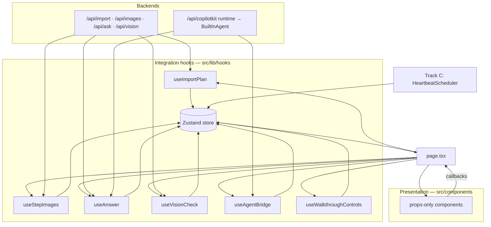
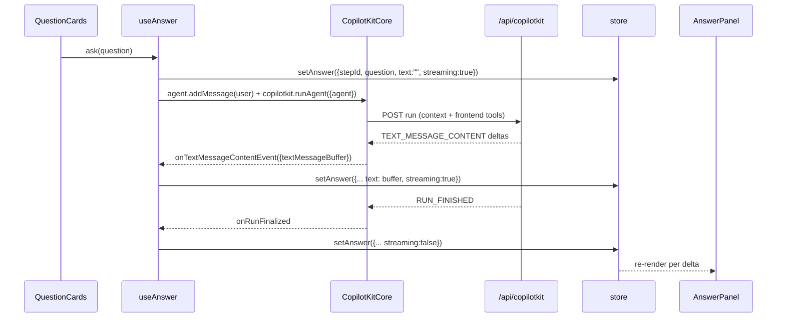

# Track B — Walkthrough UI Integration Plan (hooks ↔ store ↔ backend)

**Scope:** the seam between the shipped presentational components and everything that produces data for them — the Zustand store, the six `/api/*` routes (`docs/PLAN.md` §3), the CopilotKit runtime, and Track C's glue.
**Companion to:** `docs/features/walkthrough-ui/implementation-plan.md` (what to build and how it looks). This document owns *how it gets its data*. Where the two disagree, this one is newer and evidence-backed; §7 lists every supersede and the edits already applied to the companion.
**Sources:** working tree @ `521a3e9` + uncommitted Track B components, `docs/PLAN.md` §2–§4, `docs/features/glue-and-deploy/system-design.md` §4–§7, and the published type surfaces of `@copilotkit/react-core@1.71.1`, `@copilotkit/runtime@1.71.1`, `@ag-ui/client@0.0.59` (inspected from the npm tarballs; citations inline).

---

## 1. Ground truth (audited, not assumed)

| Area | State today | Consequence for this plan |
| --- | --- | --- |
| `src/components/*.tsx` (15 files, uncommitted) | **Every component is props-only.** No `fetch` anywhere; only `Timer` touches the store (`useStore(selectActiveTimer)`). | The integration layer is 100% greenfield. Components need no rewrite — they need callers. |
| `src/app/page.tsx` | Track C placeholder ("Walkthrough UI lands at checkpoint 1"). | The container that wires hooks → components does not exist yet. This is slice B1's first file. |
| `src/lib/store.ts` | `setPlan/next/prev/repeat/goto/startTimer/cancelTimer/pushCard/setAnswer` + `selectActiveTimer`. `setAnswer` upserts the newest `answer` card per `stepId`. | Streaming Q&A has a landing zone. Image backfill does **not** (see D5). |
| `src/lib/types.ts` | `Card = HeartbeatCard \| VerdictCard \| AnswerCard` already landed. | §2's "additive card variants" item from the companion plan is **done**; no further type churn needed. |
| `/api/import` | Returns `src/fixtures/plan.carbonara.json` verbatim, ignores the body. | `useImportPlan` can be built and proven end-to-end today; it flips to real plans with zero UI change. |
| `/api/ask`, `/api/vision`, `/api/heartbeat`, `/api/images` | All `501 {"error":"not implemented"}`. | Q&A must not depend on `/api/ask` for the demo path (it depends on the CopilotKit runtime instead). Vision/images degrade to `ErrorState` until Track A lands them. |
| `src/lib/glue/*` | `AppBootstrap` withholds children until flags are read and (fixture) the plan is installed; `HeartbeatScheduler` already pushes heartbeat cards. | `page.tsx` may assume `flags` exist and, under `?fixture=1`, that `store.plan` is set on first render. Heartbeat needs **rendering only**, no fetching. |
| CopilotKit | Not installed (`package.json` has no `@copilotkit/*`), no provider, no `/api/copilotkit` route. `.env` has `CPK_INTELLIGENCE_API_KEY` but **no `OPENROUTER_API_KEY`**. | Foundation §0 of the companion plan is still entirely ahead of us, with the corrections in §7 below. |
| `src/lib/fixture-responses.ts` | Uncommitted local stand-ins (`fixtureAnswerChunks`, `fixtureVerdict`). | Deleted when the real hooks land (D9). |

## 2. The layering rule

Three layers, one direction of data flow, exactly one mutation path.



Rules that make the layering load-bearing rather than decorative:

1. **Components never fetch and never import the store.** `Timer` is the one sanctioned exception (it owns a 50 ms render loop that would otherwise re-render the whole page); it reads, never writes.
2. **Hooks are the only `fetch` call sites.** One hook per backend surface. A kill-switch rule, an abort rule, and a failure rule live in exactly one place per flow.
3. **The store is the only channel from hooks to pixels.** Agent tool handlers, voice (Track C), buttons, and keyboard all call the same actions — `docs/PLAN.md` §3's "owner C only calls its actions", generalized to every producer.
4. **`page.tsx` composes; it does not compute.** It holds three pieces of local state (dismissed verdict ref, the active question, the pending error for retry) and nothing else.

## 3. Files this plan adds

| File | Owner | Purpose |
| --- | --- | --- |
| `src/lib/hooks/request.ts` | B | `runForStep()` cancellation helper + `RequestState` type (§4). |
| `src/lib/hooks/use-import-plan.ts` | B | `POST /api/import` → `setPlan`. |
| `src/lib/hooks/use-step-images.ts` | B | `POST /api/images` backfill → `applyImageUrls`. |
| `src/lib/hooks/use-answer.ts` | B | Q&A: CopilotKit run (primary) → `/api/ask` stream (fallback) → `setAnswer`. |
| `src/lib/hooks/use-vision-check.ts` | B | `POST /api/vision` multipart → `pushCard({kind:"verdict"})`. |
| `src/lib/hooks/use-agent-bridge.ts` | B | `useAgentContext` ×2 + `useFrontendTool` ×3 (§6.2–6.3). Replaces the companion plan's `src/lib/copilot-registry.tsx`. |
| `src/lib/hooks/use-walkthrough-controls.ts` | B | Nav/timer callbacks + `→ ← r` keyboard handling. |
| `src/lib/cards.ts` | B | Card selectors (§4.3). |
| `src/components/providers.tsx` | B | `CopilotKitProvider` wrapper (client). |
| `src/app/page.tsx` *(rewrite)* | B | The composition container (§8). |
| `src/app/api/copilotkit/[[...slug]]/route.ts` | A/C | Runtime route (§7.3 corrects its wiring). |
| `src/app/layout.tsx` *(one line)* | C | `<Providers>` inside `<AppBootstrap>`. |

**Announcements required before landing** (`docs/PLAN.md` §6 rule): (a) new Track B path `src/lib/hooks/**`; (b) additive store action `applyImageUrls`; (c) additive `ControlCluster` prop `timerAvailable`; (d) the agent tool set change in §7.2, because Track A's system prompt must name the same verbs.

## 4. Shared primitives

### 4.1 Cancellation: step identity, not `generation`

`generation` is the wrong guard for user-initiated requests. It is bumped by `startTimer` and `cancelTimer` as well as by navigation (`src/lib/store.ts:29-31,56-65`), so a generation-keyed abort would kill an in-flight answer the moment the cook starts a timer. Heartbeat legitimately wants that (Track C already does it); Q&A and vision want **"is the cook still on the step they asked about?"**.

```ts
// src/lib/hooks/request.ts
export const STALE = Symbol("stale");

export type RequestState =
  | { status: "idle" }
  | { status: "pending" }
  | { status: "error"; message: string; retry: () => void };

/** Runs `fn` with an AbortSignal that fires when the current step stops being `stepId`
 *  (navigation, repeat-with-goto, a new plan, or unmount via the returned disposer).
 *  Resolves STALE instead of the value if the step changed while in flight. */
export async function runForStep<T>(
  stepId: string,
  fn: (signal: AbortSignal) => Promise<T>,
): Promise<T | typeof STALE> {
  const controller = new AbortController();
  const currentId = () => {
    const s = useStore.getState();
    return s.plan?.steps[s.stepIndex]?.id;
  };
  const unsubscribe = useStore.subscribe(() => {
    if (currentId() !== stepId) controller.abort();
  });
  try {
    const value = await fn(controller.signal);
    return currentId() === stepId ? value : STALE;
  } finally {
    unsubscribe();
  }
}
```

Rules: a `STALE` result is dropped silently (no card, no error, no retry). An `AbortError` is equally silent. Only a real failure reaches `RequestState.error`. Every hook also aborts on unmount.

### 4.2 No retries, one retry affordance

Automatic retries hide breakage on stage and multiply latency. Every hook makes exactly one attempt and surfaces `retry()` bound to the original intent; `ErrorState` is the only place a retry can be triggered from. (The heartbeat scheduler already follows this rule — `system-design.md` §7: "that tick is dropped silently; no retry".)

### 4.3 Selectors must return store-owned references

Zustand v5 sits on `useSyncExternalStore`: a selector that builds a fresh object per call re-renders forever. Every selector below returns either a store-owned `Card` reference or a primitive.

```ts
// src/lib/cards.ts
export const selectHeartbeatFor = (stepId: string) => (s: StoreState) =>
  s.cards.findLast((c): c is HeartbeatCard => c.kind === "heartbeat" && c.stepId === stepId);
export const selectVerdictFor = (stepId: string) => (s: StoreState) =>
  s.cards.findLast((c): c is VerdictCard => c.kind === "verdict" && c.stepId === stepId);
export const selectAnswerFor = (stepId: string) => (s: StoreState) =>
  s.cards.findLast((c): c is AnswerCard => c.kind === "answer" && c.stepId === stepId);
export const selectCurrentStep = (s: StoreState) => s.plan?.steps[s.stepIndex];
```

Two behaviors fall out for free and need no extra code: the heartbeat toast **self-dismisses on step change** (the selector finds no card for the new step), and only the newest card of a kind is ever shown (`findLast`), satisfying "never stacks > 1".

Dismissal without card ids: `page.tsx` keeps `const [dismissed, setDismissed] = useState<VerdictCard>()` and renders `verdict && verdict !== dismissed`. Card objects are stable references inside `cards`, so identity comparison is exact and no `id` field has to be added to the frozen types.

### 4.4 Natural timer expiry does not re-render

`selectActiveTimer` returns `undefined` once `startedAt + sec*1000` passes, but nothing writes to the store at that moment, so subscribers are not notified (the same trap Track C documented at `heartbeat-scheduler.tsx:64`). `Timer` already runs its own interval. `ControlCluster`'s `timerActive` prop is therefore derived from `Timer`'s own tick — pass `timerActive={Boolean(useStore(selectActiveTimer))}` for the *start/stop label* only, and accept that the label flips on the next store event. Do not build anything correctness-critical on expiry-driven re-render.

## 5. Flow-by-flow contracts

### 5.1 Import (`ImportForm` → `/api/import` → `setPlan`)

```text
ImportForm.onSubmit({url?, text?})
  → useImportPlan().submit(input)
      flags.fixture → never fires (AppBootstrap already installed the plan; the form is not rendered)
      status "pending"  → ImportForm shows a pending state
      POST /api/import  { url?, text? }   (own AbortController; not step-guarded — no step exists yet)
      200 + RecipePlan  → store.setPlan(plan)   [stepIndex 0, timer cleared, generation++]
                        → page.tsx switches to the walkthrough branch on the next render
      non-200 / network / malformed → status "error", ErrorState(message, retry = resubmit same input)
  → useStepImages() picks up from here (§5.2)
```

Validation at the boundary: the response must have `steps.length > 0` and every step must carry `id`, `kind`, `title`, `detail`, `questions`. A response that fails this is an `ErrorState`, not a half-rendered walkthrough. Keep it to a hand-written type guard (~15 lines) — importing a zod mirror of `RecipePlan` into the client bundle for one check is not worth the bytes, and the schema already lives server-side in Track A.

`ImportForm`'s placeholder copy ("Recipe import is still wiring up — for now this loads the Carbonara sample plan") is deleted in this slice; `onUseSample` keeps the fixture shortcut by calling `setPlan(fixture)` directly with no network.

### 5.2 Image backfill (`/api/images` → plan mutation)

`docs/PLAN.md` §2 pregenerates images asynchronously after plan generation, so an imported plan can arrive with `imagePrompt` set and `imageUrl` missing. One hook, one attempt, no polling loop:

```text
useStepImages() effect, keyed on plan.id
  skip when flags.fixture || flags.noimages || no step has (imagePrompt && !imageUrl)
  POST /api/images { planId, steps: [{ id, imagePrompt }] }   // only the missing ones
  200 { [stepId]: imageUrl } → store.applyImageUrls(map)
  anything else → silent no-op (images are optional per docs/PLAN.md §7; a missing image renders the composed empty state)
```

**Why a new store action (D5):** merging URLs through `setPlan` would reset `stepIndex` to 0 and bump `generation` (`store.ts:43`) — i.e. an image arriving mid-cook would throw the cook back to step 1 and kill their timer. `applyImageUrls` merges in place and touches nothing else:

```ts
applyImageUrls(urls: Record<string, string>): void
// plan.steps.map(s => urls[s.id] && !s.imageUrl ? { ...s, imageUrl: urls[s.id] } : s)
// no stepIndex change, no generation bump; no-op when nothing matched
```

### 5.3 Q&A (`QuestionCards` → agent run → `AnswerPanel`)

Primary path is the CopilotKit runtime; `/api/ask` is the fallback the frozen API surface promises. Both write the same `AnswerCard`, so `AnswerPanel` cannot tell them apart.



Concrete wiring, all verified against the installed type surface:

```ts
const { copilotkit } = useCopilotKit();      // @copilotkit/react-core/v2 → CopilotKitContextValue.copilotkit
const { agent, isReady } = useAgent();       // default agent; isReady false ⇒ provisional stand-in, do not run

async function ask(question: string) {
  const step = /* current step */;
  useStore.getState().setAnswer({ kind: "answer", stepId: step.id, question, text: "", streaming: true });

  const sub = agent.subscribe({
    onTextMessageContentEvent: ({ textMessageBuffer }) => push(textMessageBuffer, true),
    onTextMessageEndEvent:     ({ textMessageBuffer }) => push(textMessageBuffer, false),
    onRunFailed: () => fail(),
  });
  agent.addMessage({ id: crypto.randomUUID(), role: "user", content: question });
  try {
    await runForStep(step.id, () => copilotkit.runAgent({ agent }));   // STALE ⇒ drop
  } finally { sub.unsubscribe(); }
}
```

Non-obvious constraints, each one a bug if missed:

- **Run through `copilotkit.runAgent({ agent })`, never `agent.runAgent()`.** Only the core path executes registered frontend tools (`CopilotKitCore.processAgentResult` → "Process agent result and execute tools"); the raw AG-UI call would stream text but silently ignore `highlight_step`/`start_timer`.
- **Abort on navigation** with `copilotkit.stopAgent({ agent })` in `runForStep`'s abort handler and on unmount — otherwise a long answer keeps streaming into a step the cook has left.
- **`isReady === false`** means `agent` is a placeholder that will be swapped (documented on `useAgent`); disable the question cards until it flips, rather than running against the stand-in.
- **Serialize**: one question at a time. A second tap while `streaming` is true replaces the active question — stop the current run first, then start the new one. `setAnswer` upserts per `stepId` (`store.ts:71-84`), so the panel shows exactly one answer per step.

Fallback ladder (D4 — no silent faking):

| Condition | Behavior |
| --- | --- |
| `flags.fixture` | No network, no agent run. `AnswerPanel offlineMessage="Jacques needs the network for questions — offline demo"`. |
| Runtime reachable | Agent run as above. |
| Runtime unreachable / run failed | One attempt at `POST /api/ask { planId, stepId, question, plan }`, reading `response.body` as a text stream into the same `AnswerCard`. |
| `/api/ask` also fails (today: 501) | `ErrorState("Jacques couldn't answer that", retry)`. Never a canned answer. |

### 5.4 Vision (`CameraCapture` → `/api/vision` → `VerdictCard`)

```text
CameraCapture.onCapture(file)            // <input type="file" capture="environment">, already built
  → useVisionCheck().check(file)
      flags.fixture → the hook is not wired at all; page passes onCapture={undefined},
                      which renders the component's built-in disabled "offline demo" pill
      status "pending" (camera button shows a pending state)
      runForStep(step.id, signal =>
        POST /api/vision  multipart { image: file, stepId, plan: JSON.stringify(plan) })
      200 + VisionVerdict → store.pushCard({ kind:"verdict", stepId, verdict })
      STALE / abort       → dropped silently
      non-200 (today 501) → ErrorState("Jacques couldn't read that photo", retry = resend the same File)
```

The `File` is held in the hook for `retry`; it is released when the step changes. Photos are never persisted, never inspected client-side, and never resized (a phone JPEG is acceptable; resizing is a P2-of-a-P2 optimization).

### 5.5 Heartbeat (Track C produces, Track B renders)

No Track B hook. `HeartbeatScheduler` (mounted by `AppBootstrap`) already pushes `{kind:"heartbeat"}` cards, including the fixture-mode local generator. `page.tsx` renders `useStore(selectHeartbeatFor(step.id))` into `HeartbeatToast`. The only Track B obligations are the selector (§4.3) and the overlay zone that keeps the toast above `ControlCluster` without overlapping it.

### 5.6 Navigation, timers, keyboard

```ts
// useWalkthroughControls()
onPrev:        () => useStore.getState().prev()
onNext:        () => useStore.getState().next()
onToggleTimer: () => active ? cancelTimer() : startTimer(step.durationSec ?? 0)
timerAvailable: Boolean(step.durationSec)      // new ControlCluster prop; disabled + no-op when false
keyboard:      ArrowRight→next, ArrowLeft→prev, r→repeat
               ignored when document.activeElement is input/textarea/[contenteditable],
               ignored while the import branch is showing, and ignored with a modifier held
cascadeKey:    `${step.id}:${generation}`      // repeat() bumps generation without moving stepIndex,
                                               // so re-mounting on this key replays the cascade — that is
                                               // exactly what `repeat()` is for in the UI
```

## 6. CopilotKit integration

### 6.1 Provider

```tsx
// src/components/providers.tsx  ("use client")
import { CopilotKitProvider } from "@copilotkit/react-core/v2";
import "@copilotkit/react-core/v2/styles.css";
export function Providers({ children }: { children: ReactNode }) {
  return <CopilotKitProvider runtimeUrl="/api/copilotkit">{children}</CopilotKitProvider>;
}
```

Mounted **inside** `AppBootstrap` in `layout.tsx` (one line, Track C coordinates). No browser-visible key: `runtimeUrl` is same-origin, and both `CPK_INTELLIGENCE_API_KEY` and `OPENROUTER_API_KEY` stay server-side. `useSingleEndpoint` stays unset (auto transport). The Inspector is on by default in dev on localhost and off in production — no prop needed.

The provider mounts under `?fixture=1` too, so the component tree never forks; it is inert because no hook starts a run in fixture mode.

### 6.2 Agent context — two registrations, not one

`useAgentContext({ description, value })` JSON-stringifies non-string values onto the wire, and re-registers whenever the value changes. Splitting stable from volatile keeps per-step churn to a few hundred bytes:

```ts
useAgentContext({ description: "The recipe being cooked",
  value: { title: plan.title, servings: plan.servings,
           steps: plan.steps.map(s => ({ id: s.id, kind: s.kind, title: s.title })) } });

useAgentContext({ description: "Where the cook is right now",
  value: { stepId: step.id, index: stepIndex + 1, of: plan.steps.length,
           title: step.title, detail: step.detail, doneWhen: step.doneWhen,
           ingredients: step.ingredients, tools: step.tools,
           timerRunning: Boolean(activeTimer) } });
```

This is the same grounding the voice session gets (`docs/PLAN.md` §4C), so the two surfaces answer "what's next?" identically.

### 6.3 Frontend tools — handlers, not renderers

```ts
useFrontendTool({
  name: "highlight_step",
  description: "Move the walkthrough to a specific step by id.",
  parameters: z.object({ stepId: z.string() }),
  handler: ({ stepId }) => {
    const s = useStore.getState();
    const i = s.plan?.steps.findIndex(x => x.id === stepId) ?? -1;
    if (i < 0) return `No step with id ${stepId}.`;
    s.goto(i);
    return `Showing step ${i + 1}: ${s.plan!.steps[i].title}`;
  },
});

useFrontendTool({
  name: "start_timer",
  description: "Start the countdown for the current step.",
  parameters: z.object({ seconds: z.number().int().min(10).max(3600).optional() }),
  handler: ({ seconds }) => { /* seconds ?? step.durationSec; refuse when neither exists */ },
});

useFrontendTool({
  name: "show_heartbeat",
  description: "Show one short coaching line (≤ 20 words) as a toast on the current step.",
  parameters: z.object({ line: z.string().max(140) }),
  handler: ({ line }) => { /* pushCard({ kind:"heartbeat", stepId: <from store>, line }) */ },
});
```

Three rules that keep this honest:

- **Handlers read `useStore.getState()`, never closure state.** Registration then needs no `deps` array and can never act on a stale step.
- **`stepId` for the card is taken from the store, not from the model** (except `highlight_step`, where it *is* the request and is validated against the plan). The model cannot address a step that does not exist or write a card onto the wrong one.
- **Handlers return a short string**; it goes back to the model as the tool result and keeps the follow-up sentence accurate.

Why `useFrontendTool` and not `useComponent` (D2): `useComponent` "registers a React component as a frontend tool renderer **in chat**" — its `render` is mounted by the chat message view (`CopilotChatToolCallsView` / `useRenderToolCall`). `DESIGN.md` §5 bans all chat chrome, so nothing would ever mount those renders. Routing through handlers → store → the deterministic walkthrough gives one render path instead of two, and keeps the typed-component story intact: the zod parameter schema *is* the component contract, validated before it reaches state.

## 7. Corrections to the companion implementation plan

These are already applied to `implementation-plan.md`; recorded here with the evidence.

### 7.1 `useComponent` registry → frontend-tool handlers
§4.3's four `useComponent` registrations become the three `useFrontendTool` registrations above. See D2 above for the reason.

### 7.2 Tool set: `show_verdict` and `answer_question` dropped

- **`answer_question` dropped:** assistant text already streams token-wise (`onTextMessageContentEvent` exposes `textMessageBuffer`), whereas tool arguments arrive as partial JSON that has to be reassembled before a single word can render. Plain text is both simpler and visibly faster on stage.
- **`show_verdict` dropped:** the agent has no photo. A tool that lets it emit a verdict is a fabrication vector; verdicts come from `/api/vision` via `useVisionCheck` (§5.4). `VerdictCard` is unaffected — it renders from the store either way.
- **`start_timer` added:** real agent-driven UI control that shares the store action with the buttons and voice, and is demonstrable in one sentence.

Track A's system prompt must name exactly `highlight_step`, `start_timer`, `show_heartbeat` — a model only calls tools its prompt names.

### 7.3 Runtime route: the OpenRouter wiring in §0.4 will not compile

`@copilotkit/runtime@1.71.1` depends on `ai@^6.0.104` → `@ai-sdk/provider@3.x`. This repo is on `ai@7.0.98` → `@ai-sdk/provider@4.0.14`, and `@openrouter/ai-sdk-provider@3` declares `peerDependencies: { ai: "^7.0.0" }`. A `LanguageModel` built by the repo's OpenRouter provider implements a different provider-spec major than the runtime's internals expect, so passing it as `BuiltInAgent({ model })` is a type error at best and a spec mismatch at worst.

Use the string form instead, which the runtime resolves with its own bundled `@ai-sdk/openai`:

```ts
// resolveModel(spec) → createOpenAI({ apiKey: apiKey ?? process.env.OPENAI_API_KEY,
//                                     baseURL: process.env.OPENAI_BASE_URL })(model)
new BuiltInAgent({
  model: "openai/openai/gpt-5-mini",          // first "/" splits provider; model = "openai/gpt-5-mini"
  apiKey: process.env.OPENROUTER_API_KEY!,
  prompt: JACQUES_SYSTEM_PROMPT,              // Track A
  maxSteps: 4,
})
```

with `OPENAI_BASE_URL=https://openrouter.ai/api/v1` in `.env`/Vercel. This keeps the project's one-credential rule (`docs/PLAN.md` §2), adds no dependency, and leaves `MODELS.agent` as the single place the id lives — export it as the full OpenRouter id and prefix `openai/` at the call site.

Two more route-level facts worth pinning now, since they are invisible until a tool call fails:

- **`maxSteps` defaults to `1`.** With one step the agent emits a tool call and stops — no sentence after `highlight_step`. Set `maxSteps: 4`.
- **Install pulls non-optional peers.** `@copilotkit/react-core` peers `@modelcontextprotocol/sdk`; `@copilotkit/runtime` peers `@langchain/core` (not marked optional, unlike the other LangChain/Anthropic/OpenAI peers). Expect them in the lockfile; that is not a misconfiguration.

### 7.4 Registry file renamed
`src/lib/copilot-registry.tsx` → `src/lib/hooks/use-agent-bridge.ts`. One hooks convention, one directory, and it holds no JSX now that nothing renders through the registry.

## 8. `page.tsx` composition

```tsx
"use client";
export default function Home() {
  const flags = useFlags();
  const plan = useStore(s => s.plan);
  const stepIndex = useStore(s => s.stepIndex);
  const step = useStore(selectCurrentStep);

  const importPlan = useImportPlan();
  if (!plan) return <AppShell><ImportForm onSubmit={importPlan.submit} onUseSample={importPlan.useSample} />
                              {importPlan.state.status === "error" && <ErrorState … />}</AppShell>;

  // walkthrough branch — hooks below are unconditional inside a child component
  return <AppShell><Walkthrough /></AppShell>;
}
```

`page.tsx` splits into `<ImportScreen/>` and `<Walkthrough/>` child components so the walkthrough's hooks (`useAnswer`, `useVisionCheck`, `useAgentBridge`, `useStepImages`, `useWalkthroughControls`) are never called conditionally — with `plan` undefined there is no step to ground them on. `<Walkthrough/>` renders: `Timeline` → scroll region (`StepCard`, `ImagePanel`, `QuestionCards`, `AnswerPanel`) → overlay zone (`HeartbeatToast`, `VerdictCard`) → `ControlCluster` with `CameraCapture` in its camera slot.

### Component → data source

| Component | Props ← source |
| --- | --- |
| `ImportForm` | `onSubmit` ← `useImportPlan().submit`; `onUseSample` ← local fixture `setPlan` |
| `Timeline` | `steps` ← `plan.steps`; `currentIndex` ← `stepIndex`; `onSelect` ← `store.goto` |
| `StepCard` | `step` ← `selectCurrentStep` |
| `ImagePanel` | `imageUrl` ← `step.imageUrl` (backfilled by `useStepImages`); `hidden` ← `flags.noimages`; `alt` ← `step.title` |
| `Timer` | none — reads `selectActiveTimer` itself |
| `QuestionCards` | `questions` ← `step.questions`; `activeQuestion` ← `selectAnswerFor(step.id)?.question`; `onSelect` ← `useAnswer().ask`; `cascadeKey` ← `${step.id}:${generation}` |
| `AnswerPanel` | `card` ← `selectAnswerFor(step.id)`; `offlineMessage` ← set iff `flags.fixture` |
| `CameraCapture` | `onCapture` ← `useVisionCheck().check`, or `undefined` under `flags.fixture` (renders the disabled pill) |
| `VerdictCard` | `card` ← `selectVerdictFor(step.id)` unless identity-equal to the dismissed ref; `onDismiss` ← local setter |
| `HeartbeatToast` | `card` ← `selectHeartbeatFor(step.id)` (Track C produces it) |
| `ControlCluster` | `onPrev/onNext/onToggleTimer/timerActive/timerAvailable` ← `useWalkthroughControls()`; `novoice` ← `flags.novoice`; `camera` ← `<CameraCapture/>` |
| `ErrorState` | `message`/`onRetry` ← the failing hook's `RequestState` (import, ask, vision) |

## 9. Kill switches and degradation

| Condition | `useImportPlan` | `useStepImages` | `useAnswer` | `useVisionCheck` | Heartbeat (C) |
| --- | --- | --- | --- | --- | --- |
| `?fixture=1` | never rendered (plan pre-installed) | skipped | offline placeholder, no run | `onCapture` undefined → disabled pill | local line generator |
| `?noimages=1` | unaffected | skipped | unaffected | unaffected | unaffected |
| `?novoice=1` | unaffected | unaffected | unaffected | unaffected | unaffected (mic slot inert) |
| Route 501 (today) | n/a (import returns fixture) | silent no-op | falls through to `ErrorState` | `ErrorState` | tick dropped |
| Runtime unreachable | n/a | n/a | `/api/ask` fallback → `ErrorState` | n/a | n/a |
| Step changed mid-flight | n/a | n/a | run stopped, result dropped | request aborted, result dropped | stale generation dropped |

## 10. Slices (mapped onto the companion plan's B1–B4)

| Slice | Adds | Exit check (browser, phone viewport) |
| --- | --- | --- |
| **B1** | `page.tsx` split, `use-import-plan.ts`, `providers.tsx`, layout line | `/` renders the import screen; submitting text calls `/api/import` and the walkthrough branch appears with the returned plan; a forced 500 renders `ErrorState` and retry re-submits |
| **B2** | `use-walkthrough-controls.ts`, `cards.ts`, walkthrough composition | `?fixture=1` with the network disabled: timeline advances, `→ ← r` work, `r` replays the question cascade, timer counts down and the toggle flips, heartbeat toast appears on the 5 s-attention `wait` step and disappears on step change |
| **B3** | `use-answer.ts`, `use-agent-bridge.ts`, `use-step-images.ts` | Question tap streams an answer inline with no page change; navigating mid-stream stops the run; `?fixture=1` shows the offline placeholder; Inspector lists the three tools and shows AG-UI events moving |
| **B4** | `use-vision-check.ts`, verdict/heartbeat/error polish | Photo → verdict card with the right rail color (or `ErrorState` while `/api/vision` is 501); every failure path renders `ErrorState` with a working retry |

## 11. Verification

Deliverable proof, in order:

1. `pnpm typecheck` — the only build gate Track B runs on its own (`docs/PLAN.md` §6: no repo-wide test runs mid-build).
2. `curl -s localhost:3000/api/copilotkit/info` lists the `default` agent. A rendering UI proves nothing about the runtime.
3. `curl -s -X POST localhost:3000/api/import -H 'content-type: application/json' -d '{"text":"..."}' | jq '.steps|length'` — the shape `useImportPlan` validates against.
4. Browser, `?fixture=1`, network disabled after the prewarm sequence (`system-design.md` §6): full walkthrough, timers, images, heartbeat; Q&A and camera show their offline affordances.
5. Browser, live: ask a question from a question card, watch it stream; then confirm a new thread appears in the managed CopilotKit dashboard for project `jacques` — that is the only proof the runtime actually reached Intelligence.
6. Agent-driven control: in the Inspector, invoke `highlight_step` with a real step id and watch the walkthrough move — proves the handler → store → UI path without needing the model to cooperate.

## 12. Decisions

- **D1 — Integration lives in `src/lib/hooks/**`, components stay props-only.** The 15 shipped components are already pure; keeping fetches out of them means each kill-switch and abort rule exists once. Cost: one new directory to announce.
- **D2 — Agent output reaches the UI through `useFrontendTool` handlers → store, not `useComponent` renders.** `useComponent` renders inside chat, and chat chrome is banned by `DESIGN.md` §5. Cost: the agent cannot invent a card the walkthrough doesn't already have a component for — which is the intended constraint.
- **D3 — Q&A runs through `copilotkit.runAgent({ agent })`.** Only the core path executes frontend tools. Cost: one extra hook (`useCopilotKit`) beside `useAgent`.
- **D4 — No silent fixture fallback outside `?fixture=1`.** A failing route renders `ErrorState`; the stage stays honest and Track A gets a visible signal. Cost: until `/api/vision` lands, the camera button's happy path cannot be demoed live.
- **D5 — Add `applyImageUrls` to the store.** `setPlan` resets `stepIndex` and bumps `generation`; using it for image backfill would eject a cooking user to step 1. Announce as additive.
- **D6 — Cancel on step identity, not `generation`.** `startTimer`/`cancelTimer` bump `generation`, which would abort unrelated in-flight answers. Heartbeat keeps its generation guard.
- **D7 — Two `useAgentContext` registrations (stable recipe, volatile position).** Keeps per-step re-registration small.
- **D8 — One answer per step, serialized.** Matches `setAnswer`'s upsert-by-`stepId` semantics and the one-step-per-screen rule.
- **D9 — `src/lib/fixture-responses.ts` is deleted when these hooks land.** Its own header calls it a stand-in "while the live routes land"; fixture mode uses the components' offline affordances (`AnswerPanel offlineMessage`, `CameraCapture` disabled pill) instead of synthetic answers. No second convention, no dead code.
- **D10 — Model string form for `BuiltInAgent` + `OPENAI_BASE_URL` pointed at OpenRouter.** The AI SDK major mismatch (§7.3) makes a custom `LanguageModel` instance unusable; the string form keeps the single-credential rule with zero new dependencies.

## 13. Cleanup when the slices land

- Delete `src/lib/fixture-responses.ts` (D9).
- Delete `ImportForm`'s "still wiring up" placeholder copy.
- `.env` / `.env.example` / Vercel: add `OPENROUTER_API_KEY` (still missing from `.env`) and `OPENAI_BASE_URL`; drop the stray `OPENAI_API_KEY` once the runtime route reads the OpenRouter key.
- Remove the dev-only `window.__jacques` reference from the demo checklist if it goes unused — it is Track C's handle, not a Track B dependency.
